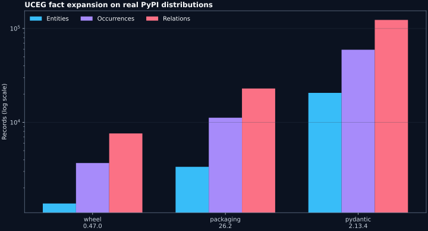
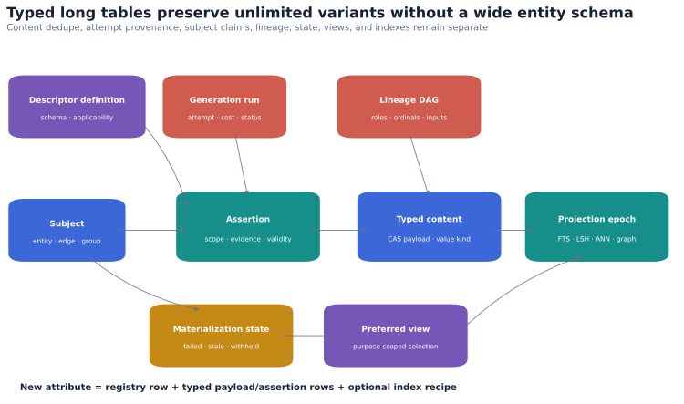
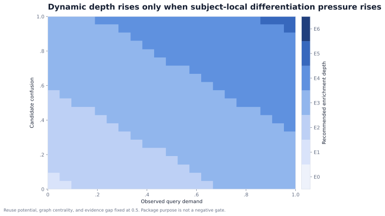
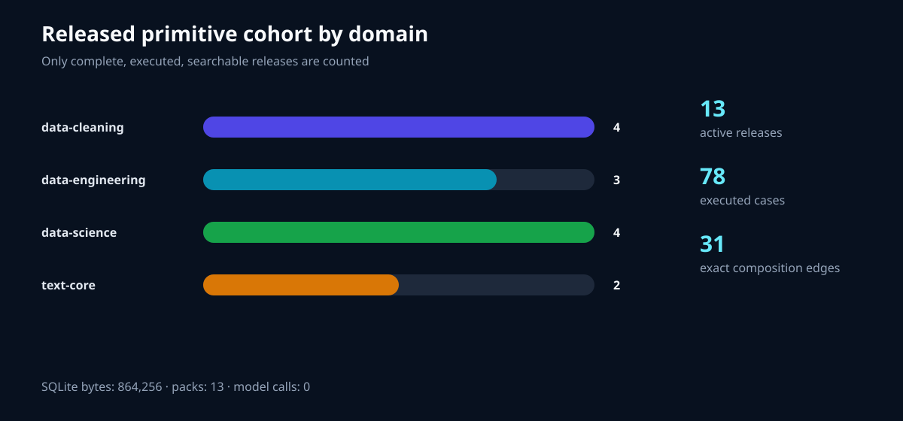
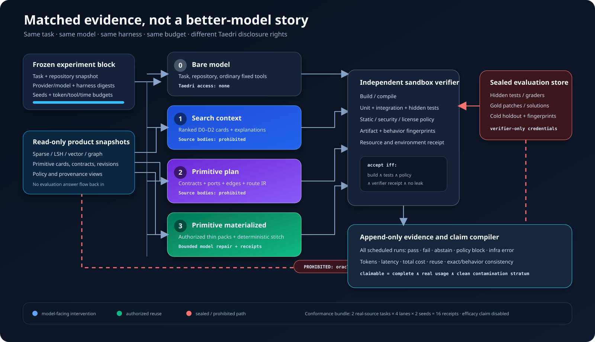

# Taedri CodeGraph

> **STOP-SHIP — NOT APPROVED FOR PUBLIC OR PAID PRODUCTION SAAS.** The runnable
> surfaces in this repository are a local developer preview and a candidate for a
> separately approved, controlled single-node private alpha. They are not an activated
> service or a GA deployment; `serves_truth=false` remains controlling.

Taedri CodeGraph is a language-neutral code-knowledge and reusable-component database.
It ingests immutable snapshots from packages, Git repositories, and other codebases;
stores exact entities, relationships, evidence, and search representations; and can
also hold Taedri-authored primitives as complete, versioned, downloadable capsules.
Tools and agents can search, trace, verify, and reuse those records without rereading
an entire package or treating generated descriptions as truth.

This repository currently contains the first executable vertical slice:

- deterministic, canonical-CBOR-backed sidecar identities that retain their full
  identity keys;
- AST-only Python ingestion that does **not** import or execute target code;
- entities, exact source occurrences, n-ary relation assertions, evidence, coverage,
  extension assertions, descriptions, and structural fingerprints;
- immutable candidate epochs and atomic publication with rollback-friendly history;
- replaceable SQLite exact, FTS5, and forward/reverse adjacency projections;
- compact CLI operations for analysis, entity search/show, and edge search/neighbors.
- typed, unlimited representation variants that separate reusable content, subject
  assertions, generation attempts, and role-labeled lineage;
- explainable hybrid retrieval over exact, FTS5, facet, scalar, blocking/LSH, bounded
  vector, and graph lanes;
- a reusable versioned mechanism runtime plus API/MCP-accessible adaptive exact → sparse
  → semantic → structural search with capability, budget, escalation, and abstention
  receipts;
- verified local-wheel ingestion with declared license provenance and distribution/import
  namespace separation;
- registry-native primitive capsules with content-addressed trees, immutable revision
  DAGs, compare-and-swap branches, forks/merges, and selective thin downloads;
- a proof-carrying primitive release path: staged candidates remain private until a
  complete 12-role capsule passes executable examples, tests, provenance, license,
  graph, deduplication, queryability, separation-of-duty, and authorization checks;
- append-only release revocation that immediately removes a primitive from public
  search, resolution, and packs without deleting its audit history;
- an AST-only primitive factory that turns real functions and methods into candidate
  capsules, contracts, graph neighborhoods, and exact/lexical/blocking/LSH search data;
- append-only candidate intake, worker lease, and privacy-aware prompt-session ledgers
  that prevent generated code from self-promoting, with automatic lease heartbeat and
  cooperative cancellation receipts;
- a sealed matched-lane benchmark worker that compares bare-model, search-context,
  primitive-plan, and materialized-composition runs with failure-inclusive receipts;
- bounded Ollama, OpenAI-compatible, Mistral, and OpenRouter chat adapters with
  provider-response usage counters captured by the operator, plus a deterministic
  fail-closed model-tier router;
- a checked prompt-interception campaign that compares showing a model all available
  primitive descriptions with showing it only the top K descriptions selected locally,
  then resolves and executes the selected pack against cases withheld from the model;
- fail-closed token accounting that keeps synthetic, reported-historical, live measured,
  and trusted-attested evidence classes separate instead of promoting a JSON label;
- a persistent, single-node authenticated control-plane POC with tenants, hashed scoped
  API keys,
  graph mounts, append-only audit chains, content-addressed job payloads, leases,
  atomic tenant quotas, and immutable usage receipts;
- a local authenticated HTTP search/context/graph/job API plus a source-mounted worker that
  can publish a new immutable epoch without importing or executing target Python;
- a locally runnable browser explorer and API/worker/frontend container definitions
  with baseline hardening controls;
- a static portal POC, versioned plan catalog, append-only subscription
  revisions, replay-safe billing-event contracts, and computed feature entitlements;
- one API/worker pipeline catalog plus allowlisted replay-safe PyPI/GitHub discovery
  events shared by admission and execution;
- a polyglot inventory adapter boundary plus optional MCP, Codex, and Claude harnesses.

The implementation deliberately separates canonical graph truth from disposable
search projections. Similarity can nominate candidates; it never proves that code
is compatible or safe to connect.

## Quick start

```bash
python -m venv .venv
. .venv/bin/activate
python -m pip install -e .

tcg analyze path ./src --store .tcg --publish
tcg search "extension registry" --store .tcg
tcg context "find an extension registry" --store .tcg
tcg edge search --predicate uceg.predicate.calls_may --store .tcg

# Generate real-source primitive candidates and the product console.
PYTHONPATH=src python tools/populate_primitive_candidates.py
python tools/generate_registry_console.py

# Generate the no-model benchmark-worker conformance evidence and console.
PYTHONPATH=src python tools/run_benchmark_worker_conformance.py
python tools/generate_benchmark_console.py

# Exercise a real Git-style custom primitive end to end.
PYTHONPATH=src python tools/run_reference_primitive_acceptance.py

# Validate one complete primitive without executing it.
tcg primitive validate examples/primitives/casefold-text

# Release, search, download, and compose two real primitives without an LLM.
PYTHONPATH=src python tools/run_deterministic_primitive_pipeline.py

# Regenerate, byte-check, and execute the complete 13-release reusable data cohort.
PYTHONPATH=src python tools/generate_data_primitive_capsules.py
PYTHONPATH=src python tools/generate_data_primitive_capsules.py --check
PYTHONPATH=src python tools/run_data_primitive_cohort.py

# Compare legacy BM25 with the versioned, budgeted primitive retrieval program.
PYTHONPATH=src python tools/benchmark_primitive_retrieval_program.py

# Preview a bounded comparison without making provider calls. The model would see all
# 11 descriptions in condition A and at most four locally selected descriptions in B.
PYTHONPATH=src python tools/run_prompt_interception_campaign.py \
  --provider mistral --model mistral-small-2603 \
  --locally-selected-description-limit 4

# Validate a saved strict-v2 campaign as an operator-captured provider-response
# measurement. Serialized JSON remains non-claimable without trusted runtime
# attestation and complete overhead receipts.
PYTHONPATH=src python tools/prove_token_savings.py \
  --campaign eval/results/prompt-interception-live-v2-2026-07-16/mistral-small-2603-k4-seeds0-1.campaign.json

# Regenerate the evidence-backed component/status/record inventory.
PYTHONPATH=src python tools/generate_component_inventory.py
```

## Local authenticated multi-process preview

The local cloud-shaped path uses one SQLite control database and local immutable graph
store. It is a runnable multi-process POC, not an activated private alpha, a
horizontally scalable production adapter, or a public SaaS service.

```bash
# Create the tenant and print a scoped API token once.
tcg admin bootstrap \
  --control .tcg/control.sqlite \
  --tenant demo \
  --name "Demo" \
  --graph-store "$(pwd)/.tcg/tenant-demo"

# Terminal 1: authenticated API.
tcg serve --control .tcg/control.sqlite --cors-origin http://localhost:8080

# Terminal 2: persistent source-analysis worker.
tcg worker run --control .tcg/control.sqlite --source-root "$(dirname "$(pwd)")"

# Or build the API, worker, explorer, and portal containers.
docker compose up --build
```

Open `http://localhost:8080`, enter the one-time token, submit a relative source path,
and search the epoch after the worker succeeds. Open `http://localhost:8081` for the
static plan and tenant-entitlement portal POC. API contracts are published at
`/openapi.json`. See
[`docs/architecture/AUTHENTICATED_SAAS_VERTICAL_SLICE.md`](docs/architecture/AUTHENTICATED_SAAS_VERTICAL_SLICE.md)
for the trust boundary and Fly.io promotion gates, and the
[`validation report`](docs/reports/AUTHENTICATED_SAAS_VERTICAL_SLICE_2026-07-16.md)
for the executed test and HTTP evidence.

The target production program and least-privilege environment matrix are in the
[`component execution plan`](docs/architecture/COMPONENT_EXECUTION_PLAN.md). Current
checkout-local component claims and open gates are machine-readable in
[`component-readiness.v1.json`](architecture/component-readiness.v1.json). This is an
inventory, not a release authority: the validator rejects any positive product
promotion from static repository files. The dated,
superseded
[`working-system checkpoint`](docs/reports/WORKING_SYSTEM_CHECKPOINT_2026-07-16.md)
records its earlier 175-test acceptance pass, Gunicorn loopback-socket smoke, database
contract, non-synthetic evidence, then-current readiness chart, and remaining external
gates.

The current mechanism/storage/search/trigger/portal/worker design is consolidated in
[`PRIMITIVE_PLATFORM_WATERFALLS.md`](docs/architecture/PRIMITIVE_PLATFORM_WATERFALLS.md),
with its machine-readable seven-waterfall contract in
[`primitive-platform-waterfalls.v1.json`](architecture/primitive-platform-waterfalls.v1.json).
It includes the regression that proved new license, integer, character, and vector
facets can receive their declared projections without a ledger migration.
The dated, superseded
[`primitive-platform acceptance report`](docs/reports/PRIMITIVE_PLATFORM_WATERFALLS_2026-07-16.md)
records its historical 233-test acceptance pass. The current design contract declares
41 API operations across 37 paths and DDL for 44 PostgreSQL tables, including
proof-gated releases and revocations; these counts do not mean a production PostgreSQL
deployment is running. The report also links the installable wheel, component
inventory, CSV/JSON evidence, and explicit hosted gates.

No third-party runtime dependency is required for the graph core. Install
`taedri-codegraph[agents]` for the optional MCP server. The supported baseline is
Python 3.12.

## Verify

```bash
python -m unittest discover -s tests -v
python -m compileall -q src tests
```

## Architectural invariants

1. Source-native names never change; uniqueness lives in sidecar identities.
2. Every exact ID is checked against its stored canonical identity key.
3. Every graph claim is scoped and provenance-bearing.
4. Missing and unknown never mean false, compatible, or wildcard.
5. Extensions are additive, namespaced, versioned, and independently governed.
6. Candidate compatibility is not canonical graph adjacency.
7. Build or runtime execution is always a separate, explicit, receipt-producing step.
8. Published epochs are immutable; indexes can be rebuilt from their manifests.
9. Sealed evaluation tasks, hidden tests, gold outputs, and answer-derived features
   never feed production retrieval, embeddings, primitive generation, or training.
10. A candidate is never a public primitive. Search, resolution, and download serve
    only an active release backed by a complete capsule and immutable acceptance proof.

See [docs/spec/FIRST_VERTICAL_SLICE.md](docs/spec/FIRST_VERTICAL_SLICE.md) for the
implemented boundary and the next gates.

## Real-package benchmark

The current slice has completed atomic end-to-end publication for real installed
Wheel 0.47.0, Packaging 26.2, and Pydantic 2.13.4 distributions. The largest run
accounted for all 105 Pydantic Python files and produced 20,616 entities, 59,423
occurrences, and 123,342 evidence-bearing relations without importing package code.



Read the [full real-PyPI benchmark report](docs/reports/REAL_PYPI_BENCHMARK_2026-07-15.md)
or inspect the [raw CSV and JSON results](eval/results/real-pypi-2026-07-15/).

The follow-up [architecture challenge](docs/architecture/UNIVERSAL_REPRESENTATION_ARCHITECTURE.md)
tests unlimited typed/provenanced variants, verified wheels, polyglot inventory, hybrid
retrieval, provider/router contracts, and agent harnesses. Its
[real-package report](docs/reports/HYBRID_ARCHITECTURE_CHALLENGE_2026-07-15.md) retains
both successful and failed retrieval cases with raw query receipts.

## Description atlas and architecture explorer

The [18,608-word Code Entity Description Atlas](docs/spec/TAEDRI_CODE_ENTITY_DESCRIPTION_ATLAS.md)
is now part of the repository. Its implementation direction uses typed long tables,
content-addressed payloads, immutable production attempts, assertion and lineage rows,
explicit materialization states, and role-scoped views—not an ever-widening entity
table.

The executable follow-up adds subject-local adaptive enrichment and overlapping
narrow/medium/wide SimHash and MinHash LSH families. A useful helper can earn deeper
descriptions independently of its parent package's stated purpose.

[Open the architecture and monorepo decision](docs/architecture/ADAPTIVE_PORTFOLIO_MONOREPO.md)
or browse the [interactive and static visual atlas](docs/visuals/README.md). The
[validation report](docs/reports/ADAPTIVE_PORTFOLIO_VISUAL_VALIDATION_2026-07-16.md)
includes the real-usaddress LSH smoke test and its intentionally retained collision
finding.





## Primitive registry and deployment evolution

Taedri-generated primitives do not need one repository or PyPI distribution each. The
default is a candidate capsule containing digest-bound source/runtime content, contract,
tests or verifiers, graph deltas, and provenance. Mature groups can later be exported as
normal Git repositories, OCI artifacts, or ecosystem packages when those collaboration
and distribution boundaries are useful.

The executable POC implements immutable revisions, optimistic branch updates, immutable
tags, cross-namespace forks, merges, role-selective packs, cached-blob omission, and
append-only revocation. Thirteen repository-native primitives contain executable source,
contract, descriptor, examples, test vectors, verifier policy, evidence-backed interface
graphs, documentation, runtime locks, license evidence, and source provenance. They remain
hidden while staged, then pass real local execution before release, search, and download.
The checked-in data cohort adds 11 common cleaning, engineering, and science utilities,
serves 13 exact targeted searches, identifies 31 blocked exact compatibility edges, and
executes text, numeric, timezone-normalization, and null-marker routes from downloaded
packs without a model call, generated code, or rewritten primitive bytes. A versioned
retrieval program then evaluates exact, labels, BM25, blocking, nonsemantic lexical-hash,
and optional true-semantic paths under explicit lifecycle and cost policy.



Read the [data primitive library guide](docs/guides/DATA_PRIMITIVE_LIBRARY.md),
the [primitive retrieval program guide](docs/guides/PRIMITIVE_RETRIEVAL_PROGRAMS.md),
the [interactive cohort console](eval/results/data-primitive-cohort-2026-07-16/index.html),
the [primitive truth and release policy](docs/architecture/PRIMITIVE_TRUTH_RELEASE_AND_LANGUAGE_SCOPE.md),
the [one-at-a-time authoring guide](docs/guides/PRIMITIVE_AUTHORING.md),
the [reuse proof status](docs/reports/PRIMITIVE_REUSE_PROOF_STATUS_2026-07-16.md),
the [component inventory](docs/reports/COMPONENT_CAPABILITY_INVENTORY_2026-07-16.md), or
browse the [interactive inventory](docs/visuals/component-capability-inventory.html).
Also read
the [primitive registry and staged deployment decision](docs/architecture/PRIMITIVE_CAPSULE_REGISTRY_AND_DEPLOYMENT.md)
or inspect the machine-readable [deployment topology](deploy/topology.v1.json). The
[validation report](docs/reports/PRIMITIVE_CAPSULE_VALIDATION_2026-07-16.md) links the
real-source capsule receipt and downloadable pack.

## Primitive factory, product console, and business model

The next vertical slice runs the primitive factory over Taedri's own implementation. It
produced 347 real-source function/method candidates, 1,812 syntax-derived call edges,
1,388 append-only intake events, two successful leased worker jobs, and a digest-only
coding-harness trace. No model or verifier was configured, so the sample session
abstained; all 347 records remain candidate-only and zero were released.


Read the [business model and product vertical-slice decision](docs/product/BUSINESS_MODEL_AND_PRODUCT_VERTICAL_SLICE.md),
inspect the [validation report](docs/reports/PRIMITIVE_FACTORY_PRODUCT_SLICE_2026-07-16.md),
or open the [interactive registry console](apps/explorer/registry-console.html). Raw
CSV, JSONL, GraphML, Mermaid, pack, receipt, and console data live in
[`eval/results/primitive-factory-2026-07-16`](eval/results/primitive-factory-2026-07-16/).

The commercial hypothesis is a private capability registry plus coding-harness wedge,
followed by team subscription, metered managed verification, and enterprise deployment.
The governing value unit is an independently accepted, policy-compliant outcome.
Currency prices and ROI claims remain unset pending customer, cost, quality, and
retention evidence; the current absence of a project license also blocks describing a
community tier as open source.

## SaaS benchmark worker

Taedri now has an executable controller for testing the product hypothesis at fixed
model quality. It defines identical repository-derived coding tasks across bare-model,
search-context, primitive-plan, and primitive-materialized lanes and validates supplied
failure-inclusive receipts containing build/test/policy outcomes, provider and tool
usage, tokens, latency, cost, component reuse, consistency, and contamination strata.
The original 16-run conformance bundle does not execute model providers or a hostile-code
sandbox; it still validates contracts rather than efficacy. A separate 2026-07-16
strict-v2 set records operator-captured Mistral provider responses, checked-pack
resolution, and case execution. That evidence measures only the selection/context
stage, uses a mostly constructed in-catalog cohort, and does not replace the
still-required sealed end-to-end coding-session campaign. Failed Ollama and OpenRouter
strict-v2 calls are retained but support no token or fidelity comparison.



Read the [architecture and real campaign design](docs/architecture/SAAS_BENCHMARK_WORKER.md),
inspect the [POC report](docs/reports/SAAS_BENCHMARK_WORKER_POC_2026-07-16.md), or open
the [benchmark evidence console](apps/explorer/benchmark-console.html). The checked-in
16-run bundle uses two Taedri source tasks and bound primitive/search snapshot
identities, but deterministic fixture receipts and no model call. Its report therefore
sets `efficacy_claimable` to `false`; it validates the worker, not the SaaS benefit.

## Live primitive-selection measurements

The strict-v2 evidence compares two plainly defined conditions under the same task, provider,
model, seed, output bound, and checked execution verifier:

- **A — all descriptions:** the model sees descriptions of all 11 released primitives.
- **B — locally retrieved descriptions:** deterministic local BM25 ranks the
  descriptions against the task text, then sends a smaller relevance-ordered set of
  up to 1, 2, 4, or 8 descriptions with condition-local opaque handles.

For Mistral `mistral-small-2603`, all locally reduced conditions selected packs that
passed every executed check. Strict-v2 provider-response prompt-plus-completion totals
were 9,063→2,111 at K=1, 9,063→2,800 at K=2, 18,125→8,090 across two seeds at K=4,
and 9,062→5,068 at K=8. A separate five-task workload derived from public GitHub
issues measured 5,056→2,179 at K=4 with 5/5 accepted selections in each condition and
20/20 executed cases passing. Across successful strict-v2 Mistral campaigns, 98/100
calls selected a checked pack and all 196 resulting case executions passed. Both
retained model abstentions occurred in the all-description condition.

Fresh bounded Ollama and OpenRouter portability campaigns are retained: all 12 calls
ended in provider errors before a usage receipt or primitive execution, so no token or
fidelity comparison is reported for them. The older v1 pilot remains available as
historical live observation evidence, including its successful three-task Ollama run,
but v1 cannot prove a complete declared task matrix or arm-specific verifier
occurrences and is always non-claimable.

These are operator-captured provider-response measurements and checked-pack executions,
not a complete coding-session savings claim. The tasks are plausible but constructed,
and their cases are withheld from model calls rather than cryptographically sealed.
Format 2.0.0 closes the serialized task-matrix and verifier-occurrence gaps, but it
still does not turn operator-captured provider counters into trusted or all-cost
savings evidence.
Read the
[strict-v2 plain-language evidence report](eval/results/prompt-interception-live-v2-2026-07-16/README.md)
and inspect its exact sanitized campaign receipts, proof-tool measurements, summary
JSON, CSV, hashes, and every non-success outcome. The
[legacy-v1 report](eval/results/prompt-interception-live-pilot-2026-07-16/README.md)
is preserved separately rather than silently rewritten.

## Launch truth

The repository is runnable today as a local developer preview and is a candidate for a
controlled, single-node private alpha. Here, **private alpha** means an operator knows
each participant, controls the host and data, can cap workloads, and accepts manual
recovery. It has tenant-scoped API keys, quotas, immutable usage and audit receipts,
authenticated APIs, persistent workers, primitive release/revocation, browser surfaces,
container definitions, and restart/tenant-isolation tests.

**Production SaaS** means untrusted public or paid tenants can rely on durable shared
infrastructure, enforced isolation and entitlements, monitored service objectives,
tested recovery, and support/incident procedures. This repository does not yet provide
evidence for that promise. The private-alpha release bar and the production-SaaS release
bar are different.

The remaining production gates are concrete: OIDC browser identity; configured and
verified billing webhooks; PostgreSQL and object-store production adapters; hostile-code
resource isolation; hosted multi-tenant load/SLO evidence; telemetry; backup/restore and
incident drills; signed packs; and a sealed, multi-task, multi-model end-to-end coding
campaign. A document, deployment manifest, or passing local fixture is not substituted
for any one of these gates.

## Project status

Working local developer preview / controlled private-alpha candidate; not approved or
activated as a public or paid service. The current slice
proves the identity/evidence/ingestion/publication/query
spine, the universal representation extension mechanism, real-source primitive
candidate generation, a complete Git-hostable custom primitive, proof-gated Python
release and revocation, append-only operational receipts, and self-contained frontends.
Inventory and exact graph storage are language-neutral; semantic extraction and
executable release verification are Python-first. Remote PyPI/Git acquisition for the
factory, semantic analyzers and trusted release verifiers for additional languages,
PostgreSQL repository and object-store adapters, production embedding/ANN providers,
OIDC browser sessions, independent hostile-code sandbox verification, calibrated fusion, a live
billing-provider adapter, and broad compatibility/adapter/branching routing remain
explicit later milestones. Exact adapter-free unary Python wiring is implemented.
Tenant authorization and a local persistent HTTP/worker path execute with the
single-node SQLite adapter.

No project license has been selected yet; all rights are reserved until one is added.
