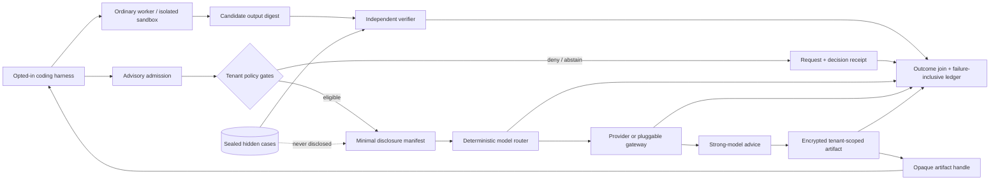

# Premium prompt interception and teacher distillation

Status: local body-free interception, scoped checked-pack resolution, cases withheld
from model calls, a two-condition campaign library, and strict-v2 operator-captured
provider-response evidence are implemented; the hosted premium service, its production
tenant controls, encrypted advisory store, and distillation/shadow pipeline are not

Decision date: 2026-07-16

## Decision

Taedri now has a local reference for an explicitly invoked advisory stage. The current
comparison uses two conditions:

- **All descriptions:** the model receives the task and body-free descriptions of all
  11 released primitives in canonical order.
- **Locally selected descriptions:** deterministic local BM25-like retrieval first
  ranks the released descriptions against the task. The model receives only
  positive-scoring matches, up to the configured maximum, in relevance order.

The model selects one call-local opaque route handle. Trusted local code maps that
handle to a scoped primitive-pack handle, verifies the pack, executes it, and compares
the output with cases excluded from the model request. Machine JSON retains historical
field names such as `full_catalog` and `deterministic_shortlist`; prose uses the two
plain condition names above.

The hosted product may place this stage server-side only after the additional tenant
gates in this document exist. It must not silently capture editor text, replace the
user's selected model, write to the workspace, execute model-chosen tools, or declare
its own answer correct.

"Interceptor" means a declared stage in the Taedri request path. It does not mean
undisclosed surveillance or a client-side key logger. The harness and tenant policy
must opt in, the response must identify whether the stage ran, and a rejected gate must
produce an abstention receipt rather than a hidden fallback.

The stronger model is a teacher in two distinct senses:

1. online, it may produce advice that a cheaper/local worker can choose to use; and
2. offline, policy-eligible advice joined to independent outcomes may train cheaper
   rules, gradient-boosted trees, embedding/ranking models, or a small language model.

Teacher output remains an assertion, not canonical truth. A claimable task outcome
requires a separately governed verifier using a sealed oracle that was never disclosed
to either model. The business question is therefore not "did the teacher sound better?"
but "did the disclosed intervention improve independently accepted outcomes enough to
cover every incremental cost and risk?"

## Existing foundation and implementation boundary

The proposal builds on five implemented, narrower components:

- `src/taedri_codegraph/model_routing.py` evaluates capabilities, privacy mode,
  network permission, estimated cost, latency, and health, then emits a stable
  `ModelRouteDecisionReceipt` without a credential surface;
- `src/taedri_codegraph/model_providers.py` executes bounded non-streaming Ollama,
  Mistral, OpenRouter, or generic compatible chat calls and emits secret-free provider
  usage receipts;
- `src/taedri_codegraph/benchmarking.py` freezes provider-neutral matched lanes,
  defines the sealed-oracle boundary required for a claimable campaign, retains
  terminal failures, and compiles claim-aware comparisons;
- `src/taedri_codegraph/token_savings.py` resolves complete pairwise model-attempt and
  independent-verifier receipts under exact evidence classes;
- `src/taedri_codegraph/prompt_interception.py` loads digest-checked released packs,
  exposes compact body-free cards through opaque route handles, builds an integer-only
  deterministic shortlist, validates a bounded strict-JSON teacher selection, resolves
  the selected scoped pack handle, executes withheld cases through a distinct local
  verifier path, and emits failure-inclusive all-descriptions/top-K campaign receipts.

The local implementation deliberately has no tenant or server surface. Its
`ScopedArtifactHandle` is authority only inside one checked cohort: it validates scope,
safe relative location, pack identity, digest, and size before resolution. It is not an
encrypted, tenant-authorized, expiring production handle. The natural-task fixture and
an injected test provider remain conformance inputs. Current strict-v2
operator-captured provider-response evidence is checked in under
`eval/results/prompt-interception-live-v2-2026-07-16/`. The older
`prompt-interception-live-pilot-2026-07-16/` directory contains legacy-v1 observations
and is not part of the strict-v2 aggregate.

`tools/run_prompt_interception_campaign.py` exposes that local reference as a bounded
operator CLI. It emits only a dry-run schedule by default, requires an explicit live
flag or `TAEDRI_LIVE_MODEL_CAMPAIGN=1`, accepts credentials only from a named
environment variable or one stdin line, and enforces the exact
`tasks × seeds × two conditions` provider-call cap before provider construction. The
checked campaigns used explicit bounded activation; ordinary tests and CI remain
offline and require no provider credential.

Still unimplemented are the premium HTTP/agent endpoint, principal/tenant admission,
encrypted request/advice storage, regional deployment enforcement, spend reservation,
production handle authorization/expiry/deletion, teacher shadow sampling, training
jobs, student promotion, billing, and the multi-model proof extension. This document
specifies those gates; it is not evidence that they have passed.

## Target server-side flow



The strong provider receives only the disclosure manifest's resolved content. It does
not receive the sealed-oracle reference, hidden tests, gold answer, tenant credential,
billing metadata, or retention policy. The artifact store treats model output as
potentially sensitive because it may repeat its inputs.

### Advisory request

The local `NaturalPrimitiveTask` freezes trajectory, task, step, domain, natural
request, request digest, and a digest-addressed set of at least two hidden cases. Only
the natural request and body-free `PrimitiveCard` values enter `ChatMessage`; hidden
inputs/expected outputs and real pack handles stay outside the provider call.

A hosted `AdvisoryRequest` must additionally freeze at least:

- content-addressed request identity and idempotency key;
- tenant, workspace, principal, purpose, and policy revision;
- task and repository snapshot references plus a digest of model-visible input;
- permitted context/artifact handles and their provenance;
- requested advice type and required model capabilities;
- privacy mode, network permission, residency set, and retention class;
- disclosure depth, byte/token cap, source-body permission, and forbidden references;
- allowed effect, maximum provider cost, maximum latency, and completion-token budget;
- experiment/campaign identifiers when the call is part of a matched block.

Raw prompt text may live transiently in an authorized encrypted request store, but the
ordinary control-plane identity and audit chain should use a digest or opaque handle.
Credentials are execution inputs held by the provider worker and are never request
fields.

### Admission and request receipt

Admission first resolves tenant authorization, data classification, egress, retention,
residency, disclosure, effect, and spend. It reserves the worst-case declared spend
before making a network call. Unknown price, region, provider retention, or model
identity fails closed for restricted work.

The implemented `PromptInterceptionReceipt` records trajectory/task/step, request and
catalog digests, retrieval arm and shortlist limit, ranked candidates, every exclusion
or non-selection reason, selected primitive/release/pack identities, scoped artifact
handle, terminal status/error code, and the complete provider usage receipt. Strict
output parsing rejects oversized output, invalid/duplicate-key JSON, extra/missing
fields, the wrong reason code, or a route outside the disclosed candidates.

A hosted request receipt must add the admission policy decision, exact policy and
router versions, every evaluated model arm and rejection reason, selected/fallback
arms, reserved/reconciled budget, disclosure-manifest digest, tenant scope, and
terminal status. It contains neither raw prompt text nor a secret. An interceptor that
decides not to call a teacher is still observable through this receipt.

### Provider call and usage receipt

The provider worker resolves a credential only after admission, uses a bounded
non-streaming call, and returns the provider usage receipt described in
`docs/guides/MODEL_PROVIDERS.md`. The route must not silently cross a disallowed region,
provider, privacy policy, model revision, or price ceiling during retry or fallback.

The current token counters are operator-captured fields from provider responses. They
are accounting observations, not provider-signed attestations, invoices, or outcome
evidence. The response cannot establish that an answer was used, that a resulting patch
built, or that withheld cases passed.

### Advisory artifact and handle

In the local reference, the teacher sees only ephemeral route handles such as `c001`.
After a valid selection, Taedri binds the receipt to the corresponding
`ScopedArtifactHandle`; the resolver accepts it only if it exactly matches a checked
catalog record, then verifies the encoded pack's size and digest. The teacher never
sees the cohort location, pack body, pack ID, release ID, or revision ID. This is a
useful local authority boundary, but it has no tenant ACL, encryption, expiry, or
revocation.

In the hosted design, the response is written to a tenant-scoped encrypted artifact
store before the caller receives anything. The internal record binds:

- content digest, media/schema type, size, creation time, and producer receipt;
- tenant/workspace ACL, source disclosure lineage, data classification, and region;
- retention/deletion/legal-hold policy and latest permitted access time;
- advice kind, model identity, prompt/request digest, and policy revision;
- whether the artifact is advisory-only, eligible for sandbox materialization, or
  ineligible for any effect.

The external handle is opaque and authorization-checked on every resolution. It should
not be a globally reusable bare content digest, because cross-tenant equality and
existence can themselves leak information. A handle is not a bearer credential for
the provider, cannot widen its artifact's policy, and expires independently of the
underlying audit receipt.

The harness receives the handle, a minimal disclosure summary, and receipt references.
It resolves the advice only when its own policy permits. No default path applies a
patch or invokes a tool merely because a strong model produced it.

## Hard tenant controls

| Control | Required behavior |
|---|---|
| Tenant and principal | Authorize request creation and every handle resolution in the same tenant/workspace scope. Shared cache hits must not reveal that another tenant has matching content. |
| Privacy | Honor `local_only`, `restricted`, or `hosted_allowed` before routing. A derived summary or embedding inherits the conservative privacy of its inputs. Cross-tenant teacher data is off by default. |
| Retention and deletion | Attach a declared TTL or legal-hold class to raw request, advice, receipts, and training examples. Expiry revokes handles and deletes eligible content. If a derived model cannot honor deletion, the source is not admitted until an approved retain-through-training policy exists; affected models must be retired/retrained rather than falsely claiming erasure. |
| Residency | Constrain request processing, provider route, artifacts, logs, backups, and training jobs to an allowed region set. A hostname is not residency evidence; require provider/deployment configuration and operational attestation. |
| Spend | Enforce per-request, daily, campaign, and monthly tenant ceilings; reserve before execution and reconcile against operator-captured provider-response usage and, where available, separately obtained billing records. Count retries, fallbacks, shadow calls, verification, storage, and infrastructure. Unknown price fails closed. |
| Disclosure | Allow only named descriptor depths and authorized source bodies under byte/token caps. Record every resolved handle and digest. Secrets, hidden cases, gold answers, and forbidden evaluation references are never disclosable. |
| Effect | Start with `advisory_only`. A later `sandbox_proposal` may write only to an isolated candidate workspace and still needs independent verification. Production/workspace writes, deployment, network mutation, and application-credential use require separate explicit authorization; the model has no such capability, and its provider credential stays header-only in the worker. |

Tenant administrators must be able to disable the interceptor, restrict providers and
model tiers, cap the sample rate, inspect receipts, revoke handles, and export or delete
eligible artifacts. Users must see a clear indicator when strong-model advice was
requested, denied, returned, materialized, or ignored.

Provider terms and settings are versioned policy inputs. Taedri must not infer
no-training, no-logging, retention, or residency guarantees from a marketing label. A
route is eligible only when the tenant's contract and deployment evidence satisfy its
declared policy.

## Independently verified outcome join

The teacher response, student response, and provider receipts do not carry a success
bit that Taedri trusts. The implemented `IndependentPackVerifier` resolves the selected
checked pack, digest-validates it, runs every withheld case through the deterministic
pipeline executor, and records only case input/expected/output digests, pipeline
receipt IDs, pass/fail, and bounded error codes in its content-addressed receipt. Its
accepted bit requires every case to pass.

That verifier is logically isolated from the teacher prompt, but the local library is
not yet a separate service or principal. A hosted verifier must run under a different
identity and capability set from every model runner. It receives the selected artifact
and sealed oracle only after model execution has terminated.

An outcome join should bind:

```text
task_ref + snapshot_ref + frozen context digest
  -> advisory request and disclosure-manifest digests
  -> route-decision and provider-usage receipt digests
  -> advisory artifact digest/handle history
  -> every ordered student/teacher attempt receipt
  -> exact candidate output digest
  -> independent verifier config + sealed oracle ref
  -> accepted/rejected outcome and complete failure class
```

The join fails closed if an attempt is missing, the verifier checked another output,
the oracle or context differs, the runner and verifier identity are the same, a receipt
belongs to another run, or an unassigned receipt suggests selective omission. Retain
rejected advice and unused handles as bounded audit metadata so outcome analyses do not
condition only on successes.

Hidden cases remain verifier-only. They are never sent to the strong model, student
model, selector, retrieval index, embedding job, training example, repair prompt, or
shadow-audit request. Outcome labels may say that an independently evaluated artifact
passed a declared contract; they must not expose the hidden case content or gold
solution as a feature.

## Teacher-to-cheaper distillation

The distillation corpus is not "all intercepted prompts." A training row is eligible
only after tenant authorization, rights review, retention compatibility, source-policy
inheritance, redaction/secret scanning, immutable feature snapshots, and an independent
outcome join. Cross-tenant learning requires a separate explicit grant; de-identifying
text does not by itself grant reuse rights.

Each row should retain the visible-input digest, allowed feature view, teacher and
student route identities, advisory/output digests, provider usage, verifier outcome,
failure class, policy scope, and split assignment. Split by repository, task family,
tenant, and time as appropriate so near-duplicate or future-derived examples cannot
leak into the holdout. Never train on the final cold holdout used to decide promotion.

The cheapest faithful mechanism wins:

| Student form | Appropriate target | Promotion evidence |
|---|---|---|
| Deterministic rules | Stable policy gates, capability checks, obvious abstentions, disclosure-depth limits, and repeated exact routing decisions | Human-readable rule diff, exhaustive boundary tests, zero policy regressions, and matched outcome non-inferiority. |
| Gradient-boosted decision trees | Calibrated route/abstain/disclosure decisions from bounded structured features such as task family, catalog counts, retrieval margins, prior verifier classes, and cost/latency estimates | Time/repository/tenant holdouts, calibration, subgroup false-negative analysis, monotonic/policy constraints where required, and matched shadow outcomes. |
| Embedding or reranking model | Candidate ranking and task-to-capability similarity using rights-cleared visible text and teacher rankings or independently accepted pair labels | Frozen corpus and embedding revision, retrieval ablations, contamination scans, top-K recall/precision, downstream accepted outcomes, and exact disclosure accounting. |
| Small language model (SLM) | Bounded advisory schemas, query rewriting, plan completion, or repair summaries that cannot be expressed reliably as rules/features | Rights-cleared teacher outputs, no hidden cases or private reasoning, schema validity, adversarial/privacy tests, matched verifier outcomes, latency/cost receipts, and rollback-ready model identity. |

Do not require or retain a provider's private chain of thought. Distill externally
observable advice, structured decisions, rankings, and verified outcomes. Teacher
agreement is useful as a weak label; it is not a replacement for the independent
oracle. A student may outperform or disagree with its teacher on a subgroup and should
be judged on pre-registered outcome and policy endpoints, not imitation rate alone.

Rules, tree models, embedding snapshots, and SLM weights are versioned derived
artifacts. Their policy is the conservative join of source rows. Every promotion
records training-data snapshot, feature code, hyperparameters, runtime, evaluation,
approver, and active-pointer transition. No model version silently replaces another.

## Shadow audit sampling

After offline promotion, the cheaper route serves normally while an independently
sampled, policy-eligible subset is evaluated by the teacher in shadow mode. A shadow
artifact cannot change the user-visible result or workspace. When execution is safe,
teacher and student candidates are verified in separate sandboxes against the same
sealed oracle; otherwise compare only their declared advisory schema and defer an
outcome claim.

Sampling combines:

- a stable random sample for unbiased aggregate estimates;
- stratified coverage of tenant-approved task families, privacy modes, model versions,
  languages, difficulty, and cost bands;
- oversampling of low-confidence, near-threshold, abstained, novel, rare, and recently
  drifting cases, reported separately from the random estimate;
- a hard per-tenant shadow spend and disclosure budget.

The sampling policy, probability, random seed, strata, inclusion reason, and teacher
route are receipt fields. Never report the oversampled disagreement rate as population
incidence without weighting. Retain shadow failures, provider errors, teacher
abstentions, and cases where either output cannot be verified.

Measure accepted-outcome discordance, student false-accept and false-abstain rates,
policy disagreement, candidate-ranking loss, calibration, token/cost delta, latency,
and unjoinable-outcome rate. Raw teacher preference without independent execution is a
diagnostic, not an efficacy result.

## Drift, circuit breakers, and rollback

Monitor feature distribution, unseen category rate, retrieval score/margin shifts,
route and disclosure mix, teacher/student disagreement, calibration, verifier
acceptance, failure classes, cost per accepted outcome, latency, and privacy/policy
denials. Slice by tenant, repository family, language, task family, model/provider
revision, and time. A provider alias or upstream routing change is model drift even if
the public request string is stable.

Thresholds and actions are registered before looking at a promotion holdout. A breach
may increase shadow sampling, force abstention, fall back to the last accepted student,
route an explicitly eligible request to the teacher, or disable the premium stage.
Privacy, residency, disclosure, effect, and spend violations trip a hard circuit
breaker rather than a statistical warning.

Deployment proceeds offline evaluation -> shadow -> bounded canary -> tenant-scoped
promotion. The active student, rule set, feature schema, embedding snapshot, router,
policy, and provider configuration are independent versioned pointers. Rollback moves
the relevant pointer to a previously accepted immutable version and preserves the
failed version and incident receipts. Rollback never resurrects expired source data or
widens policy.

## Failure-inclusive unit economics

The economic numerator includes every resource caused by the premium path:

```text
incremental_cost =
    successful_teacher_provider_usage
  + failed/retried/fallback_teacher_usage
  + shadow_and_campaign_usage
  + student_training_and_evaluation
  + retrieval_and_selector_compute
  + sandbox_and_independent_verification
  + encrypted_storage_backup_egress_and_deletion
  + gateway_orchestration_and_observability
  + allocated_support_incident_and_compliance_operations

cost_per_independently_accepted_outcome =
  all_attempt_cost / independently_accepted_outcomes
```

Timeouts, policy blocks, abstentions, rejected outputs, unused advice, failed builds,
verifier failures, infrastructure errors, and human interventions stay in cost and
attempt denominators. Provider credits or cached tokens are reported according to
their actual billed treatment; they are not represented as zero work. Show provider
pass-through separately from Taedri subscription revenue and orchestration margin.

Distillation value is measured as avoided eligible teacher calls and any change in
independently accepted outcomes, latency, human intervention, and risk—not as raw
student/teacher agreement. Fixed training and operating costs are amortized over the
measured eligible volume, not an aspirational scale forecast.

`$200/month` is a pricing and willingness-to-pay hypothesis for a narrowly defined
premium tier, not the current price, a revenue result, or evidence of customer value.
Test it with named entitlements, spend caps, provider pass-through rules, customer
segments, and cancellation/retention measures. A positive test requires observed
repeat use and independently accepted value while leaving adequate contribution after
the complete incremental cost above. Until customer research and live failure-inclusive
cost receipts exist, publish neither ROI nor margin claims.

## Current strict-v2 evidence, legacy-v1 pilot, and future production campaign

The campaign contract is specified in detail in `docs/guides/MODEL_PROVIDERS.md`.
Current evidence is the seven-document strict-v2 set under
`eval/results/prompt-interception-live-v2-2026-07-16/`; the older pilot is described
separately below and is never merged into the strict-v2 totals.

### What the comparison changes

Both conditions receive the same natural-language task and bind the same checked
catalog, requested provider and model, seed, temperature, completion-token bound,
execution policy, and cases withheld from the model call. They differ in the context
construction performed before the model call:

- **All descriptions** sends body-free descriptions for all 11 released primitives in
  canonical order.
- **Locally selected descriptions** runs deterministic local BM25-like ranking, drops
  zero-scoring descriptions, and sends only the relevance-ordered positive matches up
  to K=1, 2, 4, or 8.

Consequently, the disclosed description set, description order, candidate count, and
call-local route-handle assignment can differ. K is a maximum, so the locally selected
condition may contain fewer than K descriptions. This is a local retrieval and context-
construction intervention, not merely deletion of a fixed tail after the prompt is
built.

The checked catalog, prompt template, harness, retrieval policy, execution policy,
provider bounds, endpoint policy, task manifest, and task × seed × two-condition matrix
are digest-bound. Strict-v2 validation requires exactly one arm for every declared
task, seed, and condition; complete matched-pair coverage; unique provider-response
receipts for completed calls; and task-, condition-, attempt-, provider-, model-,
policy-, and case-bound verifier occurrences. It rejects omitted tasks, cloned generic
verifier records, mismatched deployments, reversed arms, or identity-chain changes.

Every scheduled condition remains in the campaign receipt. Terminal classes include
`accepted`, `verification_failed`, `teacher_rejected`, `provider_failed`,
`interceptor_failed`, and `verifier_failed`; operator-captured provider-response usage
is retained whenever the response supplies it. Fixture-provider tests remain
conformance evidence only.

### Strict-v2 observations first

Five Mistral `mistral-small-2603` campaigns returned usage for both conditions. They
contain 100 operator-captured provider-response receipts across 50 within-campaign
matched task-seed observations. Repeated K experiments mean those observations reduce
to 23 unique task-and-seed keys rather than 50 unique tasks. Ninety-eight calls selected
the expected primitive, and all 196 resulting case executions passed. The two other
Mistral calls explicitly abstained in the all-descriptions condition; fail-closed code
resolved and executed no pack for them.

| Workload | Seeds | Maximum locally selected descriptions | All-description accepted | Locally selected accepted | All-description reported tokens | Locally selected reported tokens | Executed cases |
|---|---|---:|---:|---:|---:|---:|---:|
| 9 constructed tasks | 0 | 1 | 9/9 | 9/9 | 9,063 | 2,111 | 36/36 passed |
| 9 constructed tasks | 0 | 2 | 9/9 | 9/9 | 9,063 | 2,800 | 36/36 passed |
| 9 constructed tasks | 0, 1 | 4 | 17/18 | 18/18 | 18,125 | 8,090 | 70/70 passed |
| 9 constructed tasks | 0 | 8 | 8/9 | 9/9 | 9,062 | 5,068 | 34/34 passed |
| 5 external-issue-derived positive tasks | 0 | 4 | 5/5 | 5/5 | 5,056 | 2,179 | 20/20 passed |

Across those 50 usage-complete pairs, the provider responses reported 50,369 prompt-
plus-completion tokens for all descriptions and 20,248 for locally selected
descriptions: 30,121 fewer reported selector-stage tokens, or 59.8007%. These are
operator-captured response fields, not provider-signed attestations or billing records.
The aggregate repeats tasks across K settings and includes two K=4 seeds, so it is not a
unique-task population estimate.

Two additional strict-v2 portability campaigns retained all 12 failed calls: six to the
configured Ollama endpoint and six to OpenRouter. They produced no usage receipt or pack
execution, so no token or fidelity comparison is available for either campaign. Across
all seven strict-v2 documents, the 14 non-successes are the two Mistral abstentions plus
those 12 provider-call failures; none is discarded.

The same Mistral all-description request digest, requested model, temperature, and seed
selected the expected deduplication primitive in several K campaign observations but
abstained in another. That observed response nondeterminism prevents treating one run
per K as a deterministic K-specific quality result and strengthens the need for more
seeds and repeated runs.

### Legacy-v1 pilot: preserved, readable, and non-claimable

The six files under `eval/results/prompt-interception-live-pilot-2026-07-16/` predate the
strict-v2 campaign contract. They include the earlier Mistral K=1/2/4/8 observations, a
successful three-task Ollama observation, and a failed bounded Mistral Large smoke.
They remain useful historical operator observations, but they are **legacy-v1 and
non-claimable**. Version 1 cannot prove a complete declared task matrix or bind a unique
verifier occurrence to every arm, so it cannot detect some whole-task omissions or
generic verifier-record reuse. Its numbers must not replace, extend, or be summed into
the strict-v2 aggregate above.

Campaign `format_version: 2.0.0` identifies the current strict document. The `uceg:v1:`
prefix is the content-addressed identity-namespace version, not a legacy campaign
marker. Token-measurement documents currently use their own schema version and retain
the source campaign version under `campaign_validation`.

### Claim boundary and next experiment

The strict-v2 set supports only a narrow observation: local retrieval reduced the
operator-captured selector prompt-plus-completion counters in the five usage-complete
Mistral campaigns, and no selected checked pack failed an executed case. It does not
establish a causal, general, trusted, billable, or end-to-end token-savings claim.

The tasks are constructed and in-catalog; the external-issue subset is small,
manually derived, and positive-only. It has no must-abstain negatives or repository
patch trajectory, and its issue-source manifest is adjacent evidence rather than
digest-bound campaign provenance. The cases were excluded from model calls but remain
public in the repository rather than cryptographically sealed. The measurements omit a
trusted isolated-runtime attestation and complete retrieval, verification, tool, cache,
repair, later-coding, infrastructure, and billing overhead. They are not organic
production traffic.

`from_scratch` remains a planned secondary lane with no Taedri catalog. A stronger-
model experiment must be a separate matched block that repeats both conditions under
that exact model; different model tiers are never presented as a same-model comparison.
Future work also needs sealed repository-level tasks, must-abstain negatives, more
models/providers/seeds/repetitions, full coding trajectories, isolated verification,
complete overhead accounting, uncertainty, and longitudinal drift checks.

The token-evidence code retains these exact machine classes:

- `conformance_fixture` for synthetic/fixture receipt wiring, never efficacy;
- `reported_historical` for totals-only arithmetic without raw receipts, never
  efficacy;
- `verified_real_model`, a machine label that is eligible only after resolved attempts,
  independent verifier receipts, a separately trusted runtime attestation, exact matched
  acceptance, and failure-inclusive token reconciliation. Current serialized campaigns
  do not satisfy that promotion gate.

The present token-savings schema is a pairwise, single-provider/single-model proof. A
combined teacher-plus-student intervention cannot be squeezed into it without losing
the exact model invariant. Before claiming online interceptor savings, extend the
schema to bind an ordered multi-model route, every teacher/student attempt, and all
attributable overhead, then add fail-closed mismatch tests. Until then, use the current
proof only for same-model all-description/locally-selected pairs and report teacher
economics as non-claimable campaign accounting.

## Boundary relative to gateways and model routers

Taedri should integrate with a mature gateway or fleet router when it satisfies the
tenant's deployment policy; it should not reimplement provider normalization merely to
own the network hop. Adjacent systems provide useful, separable layers:

| System or research line | Capability used as an integration/reference point | Taedri-specific responsibility that remains |
|---|---|---|
| [LiteLLM](https://docs.litellm.ai/) | Unified provider I/O, proxy authentication, retries/fallbacks, project spend controls, caching, guardrails, and observability. | Primitive disclosure, tenant effect gates, artifact-handle policy, sealed verification, and outcome-joined receipts. |
| [RouteLLM](https://github.com/lm-sys/routellm) and its [preference-routing paper](https://arxiv.org/abs/2406.18665) | Learned strong-versus-weak routing and an evaluation harness. | Code-task capabilities, exact registry/retrieval snapshots, independent executable outcomes, and policy-scoped distillation labels. |
| [vLLM Semantic Router integration](https://docs.vllm.ai/projects/production-stack/en/latest/use_cases/semantic-router-integration.html) | Semantic task/model classification plus serving-stack cache, guard, and infrastructure routing. | Source/body disclosure authorization, immutable primitive lineage, advisory effects, and verifier receipt joins. |
| [TensorZero gateway](https://www.tensorzero.com/docs/gateway) | Gateway, structured inferences/episodes, feedback/experiments, and fallbacks. | The Taedri code-reuse intervention, sealed hidden-case boundary, artifact provenance, and claim policy. |
| [FrugalGPT](https://arxiv.org/abs/2305.05176) | Conceptual adaptation, approximation, and cascade strategies for reducing LLM cost. | Tenant-scoped implementation controls and failure-inclusive accepted-code economics. |
| [TwinRouterBench](https://arxiv.org/abs/2605.18859) | Step-level agent routing and trajectory-level outcome/spend evaluation as an evaluation reference. | Production receipts that join each disclosed code artifact and model step to Taedri's independent verifier. |

These references motivate pluggable transport, routing, and evaluation. They do not
serve as evidence that the Taedri premium design works, and this document makes no
comparative performance claim.

## Promotion gates

The premium interceptor remains disabled by default until all of the following have
evidence:

1. tenant-scoped request, receipt, encrypted artifact, handle authorization, expiry,
   deletion, and region enforcement;
2. spend reservation/reconciliation and hard failure-inclusive tenant limits;
3. provider-contract and deployment evidence for privacy, retention, and residency;
4. separate runner/verifier identities and a sealed hidden-case boundary;
5. complete multi-model receipt schema for any teacher-plus-student claim;
6. a rights-cleared distillation corpus and deletion-compatible derived-artifact policy;
7. offline, shadow, canary, drift, circuit-breaker, and immutable rollback tests;
8. a representative, failure-inclusive matched campaign with reported uncertainty;
9. customer research and observed unit economics before treating `$200/month` as more
   than a hypothesis.
