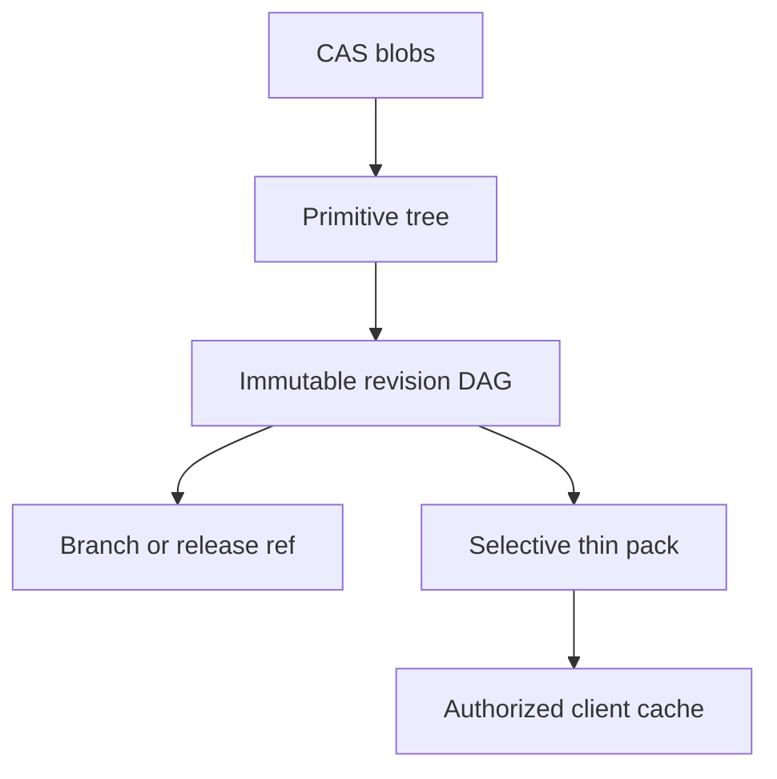
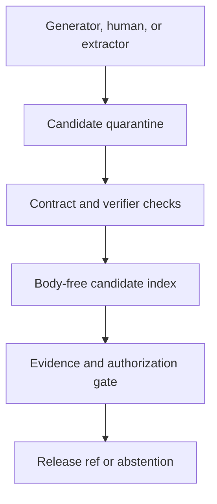
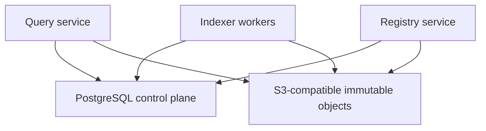

# Primitive capsule registry, distribution, versioning, and deployment evolution

Status: accepted direction with executable local POC
Date: 2026-07-16

## Executive decision

Taedri should **not** create one Git repository or one PyPI package for every primitive.
The default unit should be a registry-native **primitive capsule**: a small immutable
content tree containing source or an implementation handle, a typed contract, tests or
verifiers, dependency locks, graph deltas, documentation, and runtime artifacts. A
primitive revision points at that tree and participates in a Git-like parent DAG.

Taedri and its users can generate and submit capsules directly. Every submission begins
as a candidate with full producer, generation-run, input, test, evidence, and policy
lineage. Generation never grants correctness, promotion, public visibility, or execution
authority.

Git repositories, PyPI distributions, OCI artifacts, and language-specific packages are
important **origins or export formats**. They are not mandatory identity containers.
Creating millions of tiny repositories or distributions would add naming, release,
dependency, security, and maintenance overhead without adding evidence.

The storage decision is:

- content-addressed object storage for immutable code, pack layers, graph facts, tests,
  receipts, and cold representations;
- PostgreSQL for primitive handles, revision parents, refs, releases, ACLs, typed
  governance rows, jobs, and projection manifests;
- body-free serving indexes for exact, lexical, sparse, LSH, vector, graph, and hybrid
  search;
- selective, digest-addressed packs for cheap post-selection download;
- a monorepo and modular deployable first, followed by process groups and then separate
  services only when a measured boundary requires them.

## 1. Packaging decision matrix

| Unit | Default use | Advantages | Do not use when |
|---|---|---|---|
| Registry capsule | One generated, extracted, or user-submitted capability | Minimal overhead, exact identity, private-by-default, independent lineage, selective pull | External tooling requires an ecosystem package or independent repository workflow |
| Capability pack | Related primitives sharing runtime, license, policy, or ownership | One cached/downloaded unit; fewer round trips; coordinated verification | Members need independent access or release policy |
| Existing package/repository pointer | A primitive extracted from PyPI, Git, OCI, npm, Maven, crates.io, or another origin | Preserves authoritative upstream identity and update lineage | Taedri owns new code with no upstream artifact |
| Ecosystem package | A stable public API intended as a normal dependency | Standard installers, dependency resolution, mirrors, signatures, SBOM conventions | The item is an experimental candidate, private helper, or one tiny function |
| Dedicated Git repository | An independently governed project | Native review, issue, contributor, release, and branch workflows | The only reason is “every primitive needs a repo” |

A repository boundary is justified by independently meaningful ownership, access
control, release cadence, contribution workflow, legal policy, or build/runtime needs.
A package can contain many primitives, and one primitive can have several implementations
or language bindings.

## 2. Registry object model

The POC in `src/taedri_codegraph/primitive_capsules.py` defines the following records.

| Record | Meaning | Mutable? |
|---|---|---:|
| `PrimitiveHandle` | Stable namespaced logical capability, such as `taedri.core/normalize-text` | No |
| `BlobDescriptor` | Digest, size, and media type for one byte payload | No |
| `PrimitiveTree` | Sorted logical paths and roles pointing to blobs | No |
| `PrimitiveRevision` | Primitive, tree, contract, graph epoch, parent revisions, producer, and evidence | No |
| `PrimitiveRefUpdate` | Append-only compare-and-swap event moving a branch or creating a tag | Event is immutable; branch head is mutable |
| `PrimitivePack` | Exact selected revision/tree entries plus included and already-cached blobs | No |



Paths in a primitive tree are logical capsule paths, not mutable workstation paths.
Tree entries have explicit roles:

- `source`;
- `contract`;
- `test`;
- `verifier`;
- `dependency_lock`;
- `graph_delta`;
- `documentation`;
- `runtime`.

The contract must be a contract-role blob in the exact tree. A revision cannot merely
claim a contract digest that is absent from its downloadable content.

## 3. Self-generated primitive submission

Taedri can generate primitives itself, but generation is an intake event rather than a
publication shortcut.



Each candidate submission should bind:

1. stable primitive namespace and requested name;
2. exact source, runtime, dependency, contract, test, and graph payload digests;
3. generator/model/checkpoint, prompt/program, configuration, inputs, seed, environment,
   attempt, cost, and outputs where generation occurred;
4. origin and license evidence;
5. declared types, effects, resources, security assumptions, failure modes, and
   applicability conditions;
6. tests, properties, differential checks, independent oracles, and counterexamples;
7. visibility, tenant, retention, review, and execution policy;
8. lifecycle state and every curation, release, rejection, supersession, or revocation event.

The candidate may appear only in an authorized candidate-review index before its
implementation is released. Public primitive search reads active releases only.
Internal review results retain `indexed_candidate`, `curated_candidate`, `released`,
`rejected`, `revoked`, and explicit unknown states rather than collapsing them into one
Boolean.

## 4. Code, edges, and representations

Code bytes and graph edges have different access patterns and should not be forced into
one row or one download.

| Data | Canonical storage | Fast serving projection | Download behavior |
|---|---|---|---|
| Source/runtime bytes | CAS blob | Digest and authorized availability only | Pulled after selection |
| Contract and compact capability card | CAS plus typed registry rows | Exact/facet/lexical fields | Usually returned before bodies |
| Canonical code-entity edges | Immutable graph epoch partitions | Forward/reverse adjacency and typed filters | Neighborhood shard only when requested |
| Descriptions, labels, hashes, embeddings | Typed long-table assertions and payload CAS | Declared sparse/LSH/ANN indexes | Selected projection or evidence only |
| Tests and verifiers | CAS plus evidence links | Test/verifier capability facets | Pulled for verification or development |
| Receipts and lineage | Append-only facts and CAS | Subject/time/producer indexes | Resolved on audit demand |

A primitive revision names the graph epoch that describes its exact tree. A small
`graph_delta` blob can travel with the capsule for offline inspection, but centralized
search uses active-release adjacency and retrieval projections. This keeps the common search
path body-free and prevents every query from downloading source or an entire graph.

## 5. Git-like history without one Git repository per primitive

The registry keeps the useful content-addressed semantics:

- revisions are immutable and have zero or more ordered parents;
- a branch is a mutable namespaced ref updated by compare-and-swap;
- branch updates are fast-forward by default;
- a release tag is immutable;
- a fork creates a new primitive handle whose first revision names the upstream revision
  as both parent and explicit upstream lineage;
- a merge creates a revision with two or more parents and a separately resolved result
  tree;
- force moves, when policy permits them, remain append-only ref-update evidence rather
  than erased history.

The registry is not intended to replace full Git collaboration. It is a small revision
and distribution DAG for capabilities. A Git adapter can materialize a capsule into a
working tree, import Git commits as origins, or export a mature primitive or pack into a
real repository. Git's partial-clone design similarly separates reachable history from
promised objects fetched on demand; Taedri adopts that selective-materialization idea,
not Git's complete wire protocol ([Git partial clone](https://git-scm.com/docs/partial-clone)).

## 6. Version clocks that must remain separate

One `version` field is insufficient. At minimum Taedri retains:

| Clock | Example | Changes when |
|---|---|---|
| Logical primitive handle | `taedri.core/normalize-text` | Normally never; rename is alias/lineage |
| Contract version | `1.2.0` | Inputs, outputs, effects, guarantees, or error semantics change |
| Implementation revision | `uceg:v1:primitive_revision:…` | Tree, parents, producer event, or bound evidence changes |
| Release label | `v2.1.3` | A governed immutable ref is published |
| Origin version | PyPI release or Git commit | Upstream artifact changes |
| Representation version | embedding/model/descriptor/checkpoint | Search-assisting view changes |
| Graph epoch | `uceg:v1:graph_epoch:…` | Source-derived facts or analyzer contract change |
| Authorization/policy epoch | tenant policy revision | Eligibility or permitted effects change |

Semantic version labels aid humans and ecosystem tooling. Exact revision, tree, blob,
graph, and policy identities decide reproducibility.

## 7. Cheap, selective download

The default client flow is:

1. search body-free cards and edge projections;
2. select and authorize an exact revision;
3. request only needed roles—for example contract only, source plus dependency lock, or
   source plus verifier;
4. send cached blob digests as the client's `have` set;
5. receive one deterministic compressed thin pack containing only missing blobs;
6. validate the pack identity, every descriptor size, and every SHA-256 digest;
7. cache blobs globally by digest and record which revision was materialized.

The POC implements role filtering, `have`-set omission, deterministic gzip framing,
bounded decompression, and digest validation. A production transport should add:

- HTTP cache headers, immutable digest URLs, range requests, and conditional requests;
- pre-signed URLs for private large blobs;
- zstd-compressed pack layers and size-tiered packing to avoid both tiny-object request
  overhead and giant all-or-nothing archives;
- pack indexes or seekable frames for large bundles;
- tenant-aware encryption/key policy where deduplication could reveal equality;
- ref resolution and authorization in PostgreSQL, while bulk bytes bypass the API
  process and stream from object storage.

OCI is a useful compatible distribution adapter. Its Distribution Specification
defines digest-addressed blobs plus manifests and tags, and its image manifest can carry
non-image artifact types and multiple layers. A Taedri capsule can therefore map source,
contract, graph, tests, and runtime packs to declared media types without pretending the
capsule is a container image ([OCI Distribution Specification](https://github.com/opencontainers/distribution-spec/blob/main/spec.md),
[OCI image manifest](https://github.com/opencontainers/image-spec/blob/main/manifest.md)).
The Taedri registry contract remains provider-neutral so OCI is an adapter, not the
canonical logical model.

## 8. Physical storage layout

### PostgreSQL control plane

Use normalized typed tables for:

- primitive handles and namespace ownership;
- trees and tree entries by digest reference;
- revision rows and ordered revision parents;
- branch heads, immutable release tags, and append-only ref updates;
- candidate state, review, release, revocation, and authorization;
- tenancy, ACLs, visibility, retention, deletion requests, and legal holds;
- jobs, leases, idempotency keys, transactional outbox events, and projection epochs;
- hot exact, lexical, facet, scalar, and relational adjacency projections.

Branch/ref updates need a transaction and optimistic condition such as `WHERE
revision_id = expected_revision_id`. Object upload occurs first; the transaction then
publishes only verified digests. Orphan blobs are safe and can be garbage-collected after
a retention window.

### Object storage

Use immutable keys such as:

```text
blobs/sha256/ab/cdef…
packs/sha256/12/3456…
facts/graph-epoch-id/partition.parquet
receipts/sha256/98/7654…
```

An object is never overwritten under a digest key. Garbage collection walks from live
revisions, releases, policy-retained evidence, graph epochs, and legal holds. Deleting a
branch does not immediately delete reachable evidence.

### Serving indexes

Keep exact/ref/ACL queries in PostgreSQL initially. Use PostgreSQL FTS and pgvector only
for measured spaces that fit. Introduce an external lexical, ANN, or graph service when
its workload passes a split gate. All serving indexes remain rebuildable from immutable
facts and projection manifests.

## 9. Monorepo ownership

The monorepo should now make these boundaries visible:

```text
packages/primitive-registry/  capsule, revision, ref, fork, merge, pack contracts
packages/storage/             PostgreSQL, object-store, Parquet, and projection adapters
packages/retrieval/           body-free query planning and search lanes
services/registry-api/        submissions, refs, releases, forks, merges, authorized pulls
services/indexer/             acquisition, analysis, graph epochs, projection publication
services/query-api/           search, graph expansion, receipts, progressive disclosure
deploy/                       topology, migrations, backup/restore, observability, policies
```

The current executable POC stays in `src/taedri_codegraph` until extraction tests prove
the package boundary. Folder separation gives ownership and dependency rules now; it
does not force network calls between every component.

## 10. Deployment evolution

### Stage S0: local vertical slice

Keep the CLI, local CAS, SQLite projections, and immutable epochs for development and
offline/private use. This remains a supported product mode, not merely a temporary test.

### Stage S1: one modular service image

Deploy one tested image with at least two processes:

- `web`: query and registry APIs, authentication, ref transactions, and signed pack
  resolution;
- `indexer`: asynchronous acquisition, analysis, enrichment, and projection builds.

Fly process groups run commands in separate Machines and can scale independently while
sharing one app image. That is a useful intermediate boundary before separate services
([Fly process groups](https://fly.io/docs/launch/processes/)). Keep the web process
stateless; use a transactional job table/outbox first instead of introducing a broker
without evidence.

For a Fly deployment:

- Managed Postgres is a candidate for the transactional plane; current Fly documentation
  describes high availability, failover, backups, pooling, and pgvector, but also lists
  upgrade, alerting, and migration-tool limitations that must be reassessed before a
  production commitment ([Fly Managed Postgres](https://fly.io/docs/mpg/));
- Tigris is an S3-compatible object option with pre-signed URLs and traffic-driven
  replication, but Fly currently labels its integration beta, so keep an S3-compatible
  port and an export/restore path ([Fly Tigris](https://fly.io/docs/tigris/));
- Fly Volumes are Machine-local and do not replicate automatically. They may cache packs
  or temporary projections, but cannot be the only production copy of registry truth
  ([Fly resilient apps and volumes](https://fly.io/docs/blueprints/resilient-apps-multiple-machines/)).

### Stage S2: separate deployables only after a gate

The likely first three deployables are query, registry, and indexer. Isolated execution
and verification should be a separate security domain when they enter this repository,
because untrusted code, effects, and secrets are stronger boundaries than ordinary
module ownership.



Do not split merely because a component has a directory. Split when at least one gate has
measured evidence:

1. different trust, secret, network, or sandbox boundary;
2. independent scaling needed to meet latency/queue SLOs or avoid material waste;
3. failure or rollout isolation protects unrelated accepted outcomes;
4. incompatible runtime/resource profile or genuinely independent release cadence;
5. independent owner, tenant, region, or regulatory boundary.

Before extraction, define the versioned API/event, idempotency and retry semantics,
ownership of every write, migration/rollback, observability, load and failure test, and
compatibility window. A microservice may not write another service's tables directly.

The machine-readable version of this plan is `deploy/topology.v1.json`.

## 11. What the POC proves and does not prove

The current POC proves locally that:

- identical blob bytes and trees deduplicate deterministically;
- a revision binds an in-tree contract and optional graph epoch;
- branch updates use compare-and-swap and fast-forward rules;
- release tags cannot be moved;
- a fork retains cross-namespace upstream lineage;
- a merge retains both parents;
- clients can request selected roles and omit blobs already present;
- encoded packs are deterministic and reject digest/size mismatches.

The committed [demo receipt](../../eval/results/primitive-capsule-2026-07-16/primitive-capsule-demo.json)
and [1.8 KiB thin pack](../../eval/results/primitive-capsule-2026-07-16/canonical-identity-encoding.tcgpack)
use Taedri's real canonical-identity source and unit tests. The client declares the
4,449-byte source blob cached, so the pack carries only the contract, graph neighborhood,
and tests while retaining three revisions, fork lineage, and a two-parent merge. Its
evidence class explicitly says transport/history POC—not production authorization.

It does not yet prove:

- PostgreSQL concurrency, multi-tenant ACLs, or branch-scale performance;
- OCI registry interoperability;
- object-store latency, cache behavior, encryption, backup, restore, or garbage collection;
- zstd/seekable pack performance on large capability portfolios;
- signatures, transparency logs, SBOMs, vulnerability policy, or reproducible builds;
- independent service operation or a production Fly topology;
- that a generated primitive is correct, useful, licensed, secure, or authorized.

## 12. Next implementation gates

1. Persist the POC records in PostgreSQL with migrations and row-level tenant policy.
2. Add an S3-compatible CAS adapter with multipart upload, digest verification, pre-signed
   downloads, and reachability-based garbage-collection dry runs.
3. Build a real capsule from an existing Taedri primitive and one generated candidate;
   retain both outcomes, tests, mutations, and promotion decisions.
4. Map packs to OCI media types and run distribution conformance against a local registry.
5. Benchmark single-blob, per-role pack, whole-capability pack, and cached thin-pack pulls
   across realistic small/medium/large portfolios.
6. Connect capsule revisions to CodeGraph entities and graph epochs, then verify that
   search can return a body-free card and pull only the selected body.
7. Exercise fork, merge, revocation, deletion, legal hold, and upstream update propagation.
8. Run Stage S1 with separate web/indexer process groups, then measure before considering
   Stage S2 service extraction.
