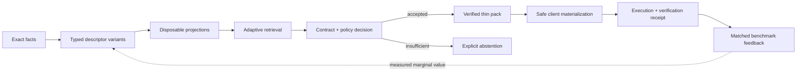
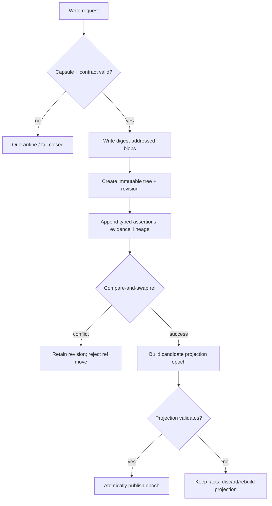
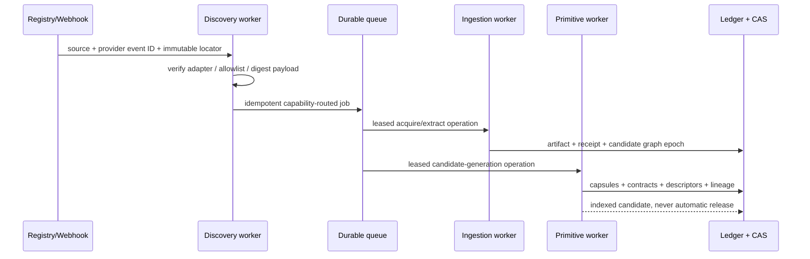

# Primitive platform waterfalls

Status: implemented local reference plus explicit hosted gates
Decision date: 2026-07-16
Machine-readable companion: `architecture/primitive-platform-waterfalls.v1.json`

## Outcome

Taedri now has one reusable, versioned mechanism runtime and seven policy-specific
waterfalls: primitive storage, primitive search, search triggering, client digestion,
static portal and plan-contract POC, source discovery/ingestion/generation, and matched benchmarking. The
waterfalls share receipt, capability, cost, failure, and abstention semantics while
remaining independently extensible.

This is not a claim that every hosted adapter is production-ready. Local storage,
retrieval, primitive packs, discovery routing, authenticated APIs, tenant subscriptions,
source acquisition, static generation, and deterministic benchmark reporting have
executable paths. OIDC, a billing-provider adapter, distributed PostgreSQL/S3
repositories, model execution, sandboxed verification, signed artifacts, and live cloud
SLOs remain gated.



## Shared mechanism contract

`src/taedri_codegraph/mechanisms/` supplies the common execution semantics:

| Contract | Meaning |
|---|---|
| `MechanismDefinition` | Immutable key/version, phase, determinism, cost, required capabilities, and produced facets. |
| `MechanismRegistry` | Add-only registry; an existing key/version cannot be silently replaced. |
| `StageDefinition` | Ordered mechanisms using all, first-success, or until-confidence evaluation. |
| `FailurePolicy` | Fail closed, continue with a partial result, or explicitly abstain. |
| `MechanismBudget` | Hard limits on attempted steps and cost units. |
| `StepReceipt` | Request/output digests, exact mechanism definition, evidence, duration, cost, status, and error class. |
| `WaterfallRun` | Frozen plan digest, all attempts, outputs, total cost, terminal status, and stop reason. |

Raw prompt or source content does not enter these orchestration receipts. A caller can
store an independently authorized encrypted reference, but the default contract records
digests and evidence identifiers.

## 1. Primitive storage

### Logical model

The authoritative representation is not a wide entity row and not a bare
`(entity, attribute, value)` triple. It is the composition of:

```text
subject
  + descriptor definition and version
  + content-addressed typed value
  + production run
  + assertion modality/polarity/confidence
  + scope and validity
  + evidence links
  + many-to-many lineage
  + lifecycle and cost
```

The local `GraphBundle` and `GraphStore` implement that split using independent
`RepresentationContent`, `GenerationRun`, `RepresentationAssertion`, and
`LineageAssertion` records. `deploy/postgres/002_representation_ledger.sql` expresses the
same shape as normalized long tables with typed, rebuildable exact, lexical, scalar,
blocking, embedding, and graph projections.

Content and provenance deliberately have different identities. If three labelers emit
the same SPDX keyword, the value bytes deduplicate, but the three runs and assertions
remain separately queryable. A later contradiction or revocation does not rewrite the
earlier record. Scoped preferred-view revisions choose a combination for a role and
purpose without declaring a globally canonical description.

The database challenge found and fixed during this pass was important: the immutable
ledger already accepted custom descriptor registries, but the index builder silently
reloaded the built-in registry. Custom license, scalar, character, and vector facets were
therefore retained but not projected. `GraphStore` now passes the exact validated
registry into the index build. The regression test adds all four value families and
many-to-one lineage without any ledger migration, then verifies their facet, scalar,
vector, and lineage projection rows.

### Storage waterfall



The custom primitive pack borrows the useful separation of digest-addressed blobs,
manifests, descriptors, and related artifacts from the
[OCI Distribution Specification](https://github.com/opencontainers/distribution-spec/blob/main/spec.md),
but Taedri does not yet claim OCI artifact interoperability. A future adapter can map a
primitive revision to OCI manifests and use subject/referrer relationships without
changing primitive identity.

Provenance terms map naturally to W3C PROV entities, activities, agents, and derivations
([PROV-O](https://www.w3.org/TR/prov-o/)). Build and acquisition receipts should also
export SLSA-style external parameters, resolved dependencies, builder identity, and run
details ([SLSA build provenance](https://slsa.dev/spec/v1.2-rc2/build-provenance)). A
signature gate can later use Sigstore/Cosign for arbitrary blobs or OCI artifacts
([Sigstore signing other types](https://docs.sigstore.dev/cosign/signing/other_types/));
signature verification is not implemented in this slice.

## 2. Primitive search

`PrimitiveSearchService` executes an adaptive candidate waterfall:

1. Exact identities, qualified names, aliases, package/version coordinates, and exact
   facets always run first.
2. Lexical full text and blocking keys broaden candidates when exact results are
   insufficient or the selected strategy is not fast-only.
3. Semantic vectors run only when policy allows them and the result set remains small or
   ambiguous.
4. Narrow, medium, and wide SimHash/MinHash profiles plus graph expansion run for deep
   search or unresolved ambiguity.
5. Typed compatibility, license/policy, evidence, and verification decide among the
   finalists. Similarity scores never become compatibility proof.

Each stage records whether it ran, its lanes, candidate count, new candidate count,
duration, and skip/stop reason. `FAST`, `BALANCED`, `DEEP`, and `AUTO` are policy inputs,
not different data models.

PostgreSQL's GIN design is a strong fit for extensible inverted projections because an
operator class extracts keys from composite values and stores posting lists rather than
requiring one entity column per term
([PostgreSQL GIN](https://www.postgresql.org/docs/current/gin.html)). PostgreSQL full-text
search provides language-aware document/query processing
([PostgreSQL text search](https://www.postgresql.org/docs/current/textsearch.html)). ANN
remains a replaceable projection: pgvector performs exact nearest-neighbor search by
default and offers HNSW/IVFFlat indexes, but approximate filtering can reduce returned
rows and needs iterative-scan or overfetch policy
([pgvector](https://github.com/pgvector/pgvector)). Taedri's canonical ledger therefore
stores the embedding descriptor, model/provider, dimensions, digest, run, and assertion;
an ANN index is never the only copy.

## 3. Search triggers and client digestion

The trigger router evaluates control tiers in this fixed order:

| Tier | Examples | Authority |
|---|---|---|
| User | explicit “search/reuse” request | Highest; not subject to automatic cooldown. |
| Deterministic | missing symbol, dependency failure, repeated boilerplate, context pressure, pre-edit hook | May trigger only under declared predicates, confidence, and cooldown. |
| Classifier | local or remote NLP classification | Proposal after deterministic rules. |
| Model | router/model suggestion | Last resort; cannot override an earlier tier. |

Signals carry an intent digest and routing metadata. Recursive guards reject fields named
prompt, message, source, code, query text, authorization, or token. Immediately before
retrieval, `TriggeredPrimitiveClient` hashes the current intent again; stale events fail
closed.

This control split also matches MCP's distinct interaction models: prompts are
user-controlled, resources application-controlled, and tools model-controlled
([MCP prompts](https://modelcontextprotocol.io/specification/2025-06-18/server/prompts),
[resources](https://modelcontextprotocol.io/specification/2025-06-18/server/resources),
[tools](https://modelcontextprotocol.io/specification/2025-06-18/server/tools)). Hosted MCP
authorization must bind tokens to the intended resource/audience rather than forwarding
arbitrary credentials
([MCP authorization](https://modelcontextprotocol.io/specification/2025-06-18/basic/authorization)).

Once a released primitive is selected, the client does not blindly unpack it. `PrimitiveDigester`
bounds encoded and expanded bytes, validates the pack identity, allowlists roles,
resolves thin-pack misses only through a digest cache, verifies every digest and size,
rejects unsafe paths/symlinks, requires a contract by default, strips executable bits by
default, writes files atomically, and returns a materialization receipt. The Python SDK
now exposes primitive stage/resolve/pack/fork/revoke methods and one-call internal
candidate or public released-primitive materialization through this digester. Staging
cannot bypass the acceptance/release transaction.

## 4. Static portal and plan-contract API POC

`apps/portal/` is a separate static container. It loads the public plan catalog, explains
the decision waterfall, and can display a tenant's current subscription and computed
entitlements. It does not contain a provider key or a hard-coded price. Plans remain in
`price_not_configured`, `provider_configured`, or `contact_sales` state.

The backend keeps:

- a versioned, additive plan catalog;
- append-only subscription revisions;
- provider-event IDs and payload digests for replay detection;
- active-state entitlement computation;
- scoped `billing:read` and `billing:write` endpoints;
- allowlisted return origins; and
- provider-neutral checkout/account redirect sessions.

Hosted operation still needs OIDC authorization-code flow with PKCE. The local portal's
password-type token input is explicitly a POC and does not persist to local storage.
Stripe's recommended customer-portal flow creates temporary sessions server-side and
uses webhooks to synchronize subscription changes
([Stripe customer portal](https://docs.stripe.com/customer-management/integrate-customer-portal));
Stripe Entitlements can provision features from active subscriptions
([Stripe subscriptions and entitlements](https://docs.stripe.com/billing/subscriptions/overview)).
Those references inform the provider port; no Stripe adapter or commercial price is
claimed here.

The 41-operation, 37-path API inventory now lives in
`src/taedri_codegraph/api/routes.py`, and OpenAPI is generated from that catalog. Route
documentation, required scopes, and implementation admission no longer have independent
handwritten operation lists.

## 5. Discovery, ingestion, and primitive generation workers

`src/taedri_codegraph/pipelines/` is the shared source of truth for operation name,
version, allowed job kind, required/conditional capabilities, network access, source
execution policy, outputs, and pipeline membership. Both HTTP admission and `JobRunner`
validate against it.



`SourceDiscoveryRouter` currently compiles allowlisted PyPI-release and GitHub-commit
events into the same executable contracts used by the API. Replay uses source + provider
event ID; a changed payload cannot silently reuse the job identity. The event digest and
identity are retained in the acquisition payload for lineage.

This worker waterfall intentionally stops at `indexed_candidate`. A complete capsule is
then staged through the registry and processed by the separate
`verify_primitive_release` operation. That operation is working for trusted-source
Python 3.12 capsules and is the only worker route that can create a public release; an
unregistered language/runtime fails closed.

For PyPI, the standards-based adapter should negotiate the JSON Simple API and retain
repository metadata, file hashes, yanked state, status, and provenance when supplied
([PyPA Simple Repository API](https://packaging.python.org/en/latest/specifications/simple-repository-api/)).
For GitHub webhooks, hosted ingress must subscribe only to required events, validate the
HMAC signature, use `X-GitHub-Delivery` for idempotency, enqueue durably, and return
quickly
([GitHub webhook best practices](https://docs.github.com/en/webhooks/using-webhooks/best-practices-for-using-webhooks),
[signature validation](https://docs.github.com/en/webhooks/using-webhooks/validating-webhook-deliveries)).
The local router does not itself expose an Internet webhook endpoint.

The source/event identity follows the same duplicate-detection idea as CloudEvents,
where a source and ID pair is unique
([CloudEvents specification](https://github.com/cloudevents/spec/blob/main/cloudevents/spec.md)).

## 6. Benchmark worker

The benchmark pipeline freezes task, model, harness, policy, retrieval snapshot,
primitive-registry snapshot, sandbox image digest, network policy, seed, repetition, and
budgets before execution. It schedules matched lanes such as bare model and
primitive-assisted harness, then compares accepted outcomes, tokens, wall time, cost,
verified reuse fraction, repairs, interventions, output consistency, and behavioral
consistency.

Only complete, real-model, clean-contamination runs may set `efficacy_claimable=true`.
Fixture data exercises contracts but cannot support a SaaS efficacy or ROI claim.
SWE-bench demonstrates the useful pattern of real repository issues evaluated in
containerized environments
([SWE-bench paper](https://arxiv.org/abs/2310.06770),
[repository](https://github.com/swe-bench/SWE-bench)). Taedri still needs a separately
credentialed sandbox/verifier and sealed non-synthetic task corpus before its matched
lanes are claimable.

## Monorepo boundaries

```text
apps/
  explorer/                 authenticated graph and worker console
  portal/                   public plans and tenant account
src/taedri_codegraph/
  mechanisms/               reusable execution and receipt contract
  primitives/               storage, search, and client digestion
  discovery/                coding-session trigger routing
  pipelines/                operation/pipeline catalog and source events
  portal/                   plan, subscription, entitlement domain
  api/                      route catalog and OpenAPI compiler
services/
  discovery-worker/         registry/webhook normalization boundary
  ingestion-worker/         acquisition and safe extraction boundary
  primitive-worker/         candidate generation boundary
  benchmark-worker/         sealed evaluation boundary
deploy/postgres/
  001_control_plane.sql     tenants, jobs, registry, sessions, usage, billing
  002_representation_ledger.sql flexible facts, provenance, lineage, projections
schemas/                    portable public contracts
eval/                       real-package and matched-lane evidence
```

These are ownership and trust boundaries, not a command to deploy 32 microservices. The
local stack remains a modular monolith with independently containerized API, worker,
explorer, and portal. Split discovery, network acquisition, generation, and evaluation
process groups when secrets, sandboxing, scaling, failure domains, or residency justify
it. Fly.io is a viable target for stateless web/process groups, but production facts and
blobs must live in PostgreSQL and S3-compatible storage rather than a single Machine
volume.

## Acceptance boundaries

Implemented acceptance covers custom descriptor projection, versioned mechanisms,
operation admission, source-event replay, safe acquisition, immutable publication,
hybrid retrieval, trigger precedence/privacy, pack digestion, portal plan/subscription
behavior, API catalog generation, and PostgreSQL DDL idempotency.

The following claims remain blocked until external evidence exists:

- production multi-tenant durability, availability, or latency;
- OIDC account security and organization administration;
- real billing checkout/webhook reconciliation;
- signed primitive and provenance verification;
- live embedding/ANN relevance and load SLOs;
- isolated behavioral verification of generated primitives;
- real-model token, speed, quality, or finance benefits; and
- successful Fly.io deployment and disaster-recovery drills.
