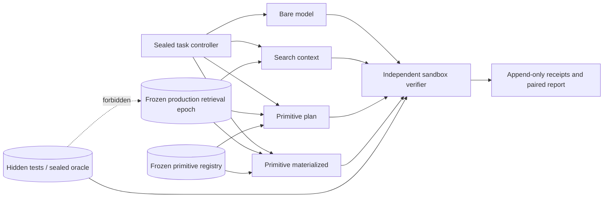

# SaaS benchmark worker and evidence boundary

## Decision

Taedri should benchmark the product as a matched intervention, not as a new model.
The same task, repository snapshot, provider, exact model revision, harness, sandbox,
verification policy, budgets, and repetition seed run through four lanes. The only
planned difference is what Taedri may disclose or deterministically materialize.

The primary endpoint is an **independently accepted, policy-compliant outcome**.
Similarity, a plausible patch, a selected primitive, or a self-reported model success
is not an accepted outcome.

The active reference implementation is
`src/taedri_codegraph/benchmarking.py`. It creates immutable task, experiment,
run-specification, worker-job, and terminal-receipt identities; enforces the
contamination boundary; retains failures; and compiles matched comparisons. It is a
provider-neutral controller. Real model, benchmark-suite, sandbox, and verifier
adapters remain external workers.

## Four matched lanes

| Lane | Taedri search | Typed cards and route plan | Source-body resolution | Deterministic composition |
|---|---:|---:|---:|---:|
| `bare_model` | No | No | No | No |
| `search_context` | Yes | D0-D2 summaries only | No | No |
| `primitive_plan` | Yes | Yes; model emits or edits a plan IR | No | Plan validation only |
| `primitive_materialized` | Yes | Yes | Selected revisions only | Yes, with bounded model repair |

The bare lane still gets the benchmark's ordinary repository snapshot and fixed tool
schema. It is not intentionally handicapped. The search lane cannot read source
bodies. The plan lane tests whether exact contracts, ports, edges, examples, and route
handles improve selection before source disclosure. The materialized lane measures
the complete product hypothesis: select an existing component, download its immutable
thin pack, deterministically insert or adapt it, and verify the result.

The next useful optional lane is `verified_route_cache`: reuse a previously accepted
composition route under the same compatibility and policy scope. It should be added
only after the four-lane experiment proves that the base intervention has value.



## What the worker freezes

A `BenchmarkExperiment` freezes:

- task identities and corpus partitions;
- lane set and repetition seeds;
- provider and exact model identity;
- model configuration, system/harness configuration, and prompt policy digests;
- retrieval and primitive-registry snapshots;
- sandbox image and verification-policy digests;
- network policy;
- prompt, completion, tool-call, wall-time, and verifier CPU budgets.

Each task references a visible request, repository snapshot, and sealed oracle. The
task stores forbidden retrieval references, strata, rights/policy scope, and optional
economic value only when that value has a provenance receipt. Raw private prompts do
not have to enter the ordinary ledger; the content digest or encrypted evaluation-store
reference is sufficient.

Every task × repetition × lane becomes an idempotent `benchmark` worker job. The job
requires both a lane capability and a sealed-oracle verifier capability. Queue retries
do not disappear from evidence: the terminal run receipt includes model attempts,
repair turns, tool calls, human interventions, failure class, time, tokens, and cost.

## Evaluation isolation is a system invariant

Production and evaluation use physically separate credentials and namespaces:

```text
production ingestion / primitive generation / search indexes
        ^                         X
        |                         X no reverse flow
        |                         X
frozen read-only snapshots ---> evaluator ---> model-facing workspace
                                      |
                                      v
                         independent verifier <--- sealed oracle
                                      |
                                      v
                               receipt-only report
```

The following never enter primitive generation, production full-text search, LSH,
embeddings, graph projections, model training, prompt caches, or retrieval logs:

- hidden tests and graders;
- gold patches, solutions, traces, and answer explanations;
- answer-derived descriptions, fingerprints, or embeddings;
- a cold holdout task body before its assigned evaluation call;
- verifier secrets or data that would let the model infer the oracle.

The controller records every retrieved entity, body resolution, tool invocation,
model usage receipt, produced artifact, and verifier receipt. An exposed forbidden
reference raises `BenchmarkContaminationError`. A detected-contamination run cannot
be accepted. Reports keep `clean`, `detected`, and `unknown` strata separate; only a
complete all-real, all-clean matched block is mechanically claimable.

A production implementation should additionally scan task and corpus partitions with
exact content digests, normalized token hashes, Winnowing, MinHash/LSH, AST
fingerprints, identifier-normalized fingerprints, and semantic task-overlap review.
The scan configuration and cutoff date are themselves versioned inputs.

## What to measure

### Correctness and verification

- accepted outcome, build, test, policy, static-analysis, and independent-verification rates;
- tests passed, failed, and skipped, reconciled to the total;
- abstention, policy block, timeout, infrastructure error, and failure class;
- dependency lock, environment, and receipt reproducibility;
- clean, contaminated, and unknown-contamination results.

The denominator is every scheduled terminal task/lane/repetition. Retry success may be
reported separately, but it never erases failed attempts or their costs.

### Consistency

Consistency is not one hash:

- **outcome consistency** asks whether repetitions reach the same terminal state;
- **exact-output consistency** compares artifact digests;
- **behavior consistency** compares independently verified behavior digests;
- **operational consistency** compares repair count, failure class, dependency lock,
  and resource envelope.

Two different patches that pass the same independent contract can be behaviorally
consistent without being byte-identical. A byte-identical wrong answer is exactly
consistent but not useful. Reports therefore show all three agreement families.

### Already-solved component reuse

- retrieved candidate, selected revision, thin-pack, and route references;
- selected-to-materialized and materialized-to-accepted conversion;
- reused versus newly authored source bytes;
- contract, adapter, route, and composition verification receipts;
- body-resolution rate after card/plan selection;
- provenance and license-policy coverage;
- disclosure depth and context bytes.

Line counts are insufficient for mixed generated/declarative assets, so bytes and
artifact roles are the wire-level baseline. Language-aware token/AST/statement counts
can be derived projections. Reuse is credited only when the final accepted artifact is
shown to contain or invoke the selected immutable revision under the declared policy.

### Token, latency, and cost efficiency

Track provider-native input, cached input, output, reasoning when exposed, and tool
tokens separately. Also track retrieval query tokens, disclosed context bytes, body
bytes, tool-call count, model time, retrieval time, verifier time, queue time, wall
time, provider cost, and infrastructure cost.

The primary efficiency expressions are failure-inclusive:

```text
total_cost = provider_cost + retrieval_cost + worker_cost + verification_cost

cost_per_accepted_outcome = sum(total_cost for all attempts)
                            / independently_accepted_outcomes

matched_token_savings = (baseline_model_tokens - treatment_model_tokens)
                        / baseline_model_tokens

verified_success_per_token = independently_accepted_outcomes
                             / total_model_and_tool_tokens
```

A treatment that saves model tokens but shifts excessive work into retrieval or
verification may still be valuable, but it is not a total-cost saving. Both views must
remain visible.

### Developer, DevOps, and finance endpoints

For real design-partner work, record time to first green build, repair turns, human
interventions, review findings, change surface, rollback rate, and user acceptance.
For DevOps tracks, add build reproducibility, deployment acceptance, rollback tests,
SBOM/lock completeness, resource limits, queue delay, and failure-domain incidents.

Financial reporting begins with observed cost per accepted outcome. Monetary value is
reported only when the task carries an external value receipt, as in a licensed
economic benchmark, or when a declared time study captures actual human time and a
pre-registered labor-cost assumption. Taedri must not turn a task label, lines of code,
or model confidence into fictional dollars.

## Statistical design

Use task-matched comparisons. Randomize or counterbalance lane order within task to
reduce provider drift and warm-cache effects. Run the same seed schedule for every
lane, but do not claim that an API provider necessarily honors deterministic sampling;
the returned usage and output receipts are authoritative.

Stratify before looking at results:

- task family: new component, repair, integration, migration, DevOps, data/finance;
- repository/package and language;
- difficulty and expected composition depth;
- cold versus previously represented capability;
- clean, contaminated, and unknown overlap;
- body disclosure depth and route width.

Start with a pilot to learn the paired discordance and cost distribution. Use that
observed variance to power the main run. Report paired confidence intervals or a
paired randomization/bootstrap analysis, not only average pass rate. Preserve a
never-tuned cold holdout for architectural decisions made after the first campaign.

Promotion should require:

1. complete matched blocks and retained failures;
2. real provider/runtime usage receipts;
3. independent deterministic verification;
4. no detected contamination in the promoted stratum;
5. success non-inferiority plus a material improvement in at least one declared
   efficiency endpoint, or a quality improvement whose extra cost is explicitly accepted;
6. uncertainty, subgroup failures, and policy limitations in the report.

## Benchmark and harness adapters

No single public benchmark proves the SaaS hypothesis. The first campaign should mix
customer-private cold tasks with several rights-reviewed evaluation-only adapters:

- [SWE-Skills-Bench](https://github.com/GeniusHTX/SWE-Skills-Bench) is unusually
  aligned with the product question because its official workflow compares a context
  intervention against a control and reports pass rate, failed tests, tokens, and
  duration.
- [SWE-bench](https://github.com/SWE-bench/SWE-bench) supplies real repository issue
  repair and a containerized evaluation harness. Its repository also documents the
  storage and compute demands of local evaluation; Taedri should start with a selected
  sealed subset rather than casually running the full suite.
- [Terminal-Bench through Harbor](https://github.com/harbor-framework/terminal-bench)
  supplies terminal tasks, test scripts, reference solutions, and a model-to-sandbox
  harness for DevOps and long-horizon system work.
- [SWE-Lancer in OpenAI Frontier Evals](https://github.com/openai/frontier-evals/tree/main/project/swelancer)
  supplies real freelance software tasks with end-to-end tests and sourced economic
  framing. It is the appropriate finance track; task bodies and graders remain
  evaluation-only.
- Private design-partner tasks are the closest evidence for product retention. They
  need consent, privacy controls, repository/time splits, and a customer-controlled
  sealed store.

Benchmark framework code may be cataloged according to its license. Task bodies,
reference solutions, hidden tests, and gold traces remain `EVAL_ONLY` unless a
separate rights and contamination decision explicitly says otherwise.

## SaaS operating model

The evaluator is a good first design-partner offer because it answers whether the
larger managed service should exist. A customer supplies a private task store and
frozen repository snapshots; Taedri supplies the matched controller, registry
snapshots, model adapters, isolated workers, verifier integrations, and evidence
report. The commercial deliverable is a decision-quality evidence bundle, not a
promised savings percentage.

The modular-monolith deployment keeps contracts in one monorepo while using separate
process groups and credentials:

- `web`: registry/query control plane;
- `indexer`: ingestion and production projection builds;
- `evaluator`: sealed controller and model-facing sandboxes;
- `verifier`: oracle-facing execution with no model route;
- PostgreSQL-compatible control state, content-addressed object storage, replaceable
  serving indexes, and a separate sealed evaluation store.

Only measured security, scaling, residency, runtime, failure-domain, or ownership
pressure justifies splitting these process groups into separately released services.

## Current evidence state

The generated bundle under `eval/results/benchmark-worker-2026-07-16` is a
**conformance fixture**, not a model benchmark. It uses real Taedri source artifacts,
real candidate/revision identities from the primitive factory, a frozen real search
snapshot, 16 scheduled lane jobs, and reconciled fixture receipts to prove serialization,
queueing, lane authorization, contamination rejection, aggregation, and reporting.

It deliberately uses provider `deterministic-contract-fixture` and model
`not-a-model`. Its report sets `efficacy_claimable` to `false`; its zero token/success
deltas are not product results. The first claimable result requires a real provider or
local-model usage adapter, an isolated executable task suite, and actual verifier
receipts.
