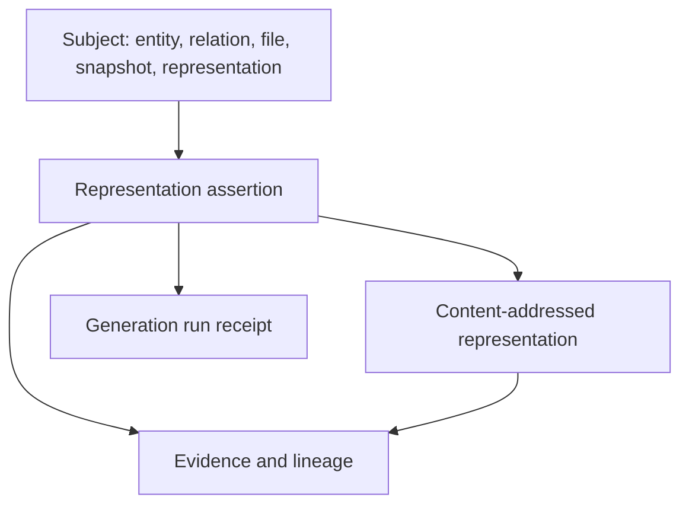
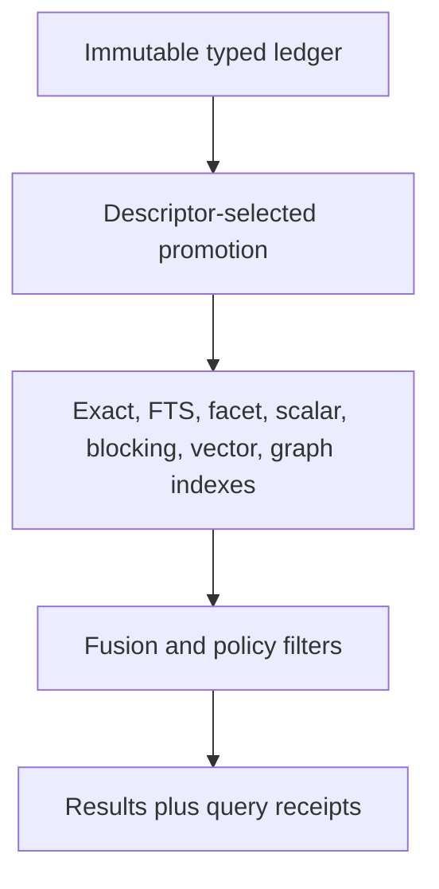

# Universal representation and retrieval architecture

**Status:** challenged POC architecture  
**Date:** 2026-07-15  
**Decision:** retain the small exact graph kernel; add typed, immutable representation
content, assertions, generation receipts, and lineage; physically promote only declared
query lanes.

## Outcome

The architecture can accept new descriptions, labels, licenses, scalar metrics,
embeddings, fingerprints, relationships, hierarchy systems, and model outputs without
adding a nullable column to `EntityRecord`. The current POC demonstrates that property.

It does **not** demonstrate that every representation should be materialized or indexed.
Logical cardinality is unbounded; every extraction job, retention tier, and serving index
still needs an explicit budget.

The governing separation remains:

```text
searchable != compatible != executable != correct != independently verified
```

## 1. What was challenged

| Requirement | POC result | Architectural consequence |
|---|---:|---|
| Add a new typed attribute | Pass | Register a representation descriptor; emit content + assertion; optionally promote an index lane. No entity-table migration. |
| Retain identical output from two attempts | Pass | `RepresentationContent` deduplicates; `RepresentationAssertion` and `GenerationRun` remain distinct. |
| Retain contradictory labels/model judgments | Pass | Polarity, producer, run, confidence, scope, and lifecycle live on independent assertions; no last-write-wins merge. |
| Add license metadata | Pass for declared wheel metadata | Raw declaration, SPDX expression, classifier, and license-file digest are separate artifact-backed assertions. Detection and compatibility policy remain future providers. |
| Add more lineage | Partial | Binary typed lineage assertions support roles and ordinals and compose into a DAG. Cycle checking and combination-level completeness validation are not implemented. |
| Add more relationships | Pass logically | Relations are n-ary participant sets with roles, polarity, modality, evidence, and snapshot scope. |
| Add multiple hierarchies | Pass logically, projection pending | Hierarchy membership belongs in typed relation assertions. A singular `enclosing_entity_id` is only a source-syntax convenience; taxonomy, ownership, package, runtime, and policy hierarchies must not use it as canonical truth. Closure/materialized-path projections are not implemented. |
| Add text, character, numeric, JSON, or vector values | Pass logically | `TypedValue` declares the wire family; native physical columns are disposable projections. Decimal and vector values avoid platform-float identity ambiguity. |
| Unlimited provenance | Pass logically | Each assertion points to a producer, generation run, evidence, scope, and immutable snapshot. Operational retention remains a policy. |
| Search with exact, lexical, facets, scalars, blocking, vector, and graph lanes | Partial | The SQLite POC implements these lanes except production ANN and decimal-range serving. It returns per-result query receipts. |
| Add real LLM/NLP/embedding systems | Pass as provider boundary, not as model evaluation | Providers declare outputs and capabilities. Attempts produce ordinary variants. No external model was called in this evaluation. |
| Scale the current physical projection | Fail | JSONL plus duplicated SQLite records grew too quickly. The logical contract survives; the POC physical layout must be replaced for production scale. |

## 2. Logical model



### 2.1 Representation content

`RepresentationContent` answers: **what bytes or typed value were produced?**

Its identity includes:

- family key;
- representation key;
- schema version;
- value kind;
- canonical payload digest.

It excludes the subject and production attempt. Two models that happen to emit the same
label can share content without losing their independent histories.

### 2.2 Representation assertion

`RepresentationAssertion` answers: **who claims this content describes this subject,
under what conditions?** It includes:

- subject and immutable snapshot;
- content reference;
- asserted, extracted, inferred, observed, or verified modality;
- positive, negative, or unknown polarity;
- producer and generation-run reference;
- evidence references;
- integer parts-per-million confidence;
- scope and valid-time bounds;
- evidence lifecycle.

Confidence is evidence about an assertion, not identity truth. Preferred values must be
versioned views over assertions; they never delete the alternatives.

### 2.3 Generation run

`GenerationRun` answers: **what attempt produced the output?** It retains an explicit
attempt key, producer/model version and configuration digest, inputs, output-set digest,
status, optional timestamps, and environment. A retry uses another attempt key even when
its output content is identical.

### 2.4 Lineage

`LineageAssertion` connects arbitrary `SubjectRef`s with a namespaced predicate, optional
role and ordinal, producer/run, and evidence. Multiple edges express many-to-many,
role-labeled inputs. Examples include:

- description derived from source, tests, and a docstring;
- embedding derived from a specific description variant;
- fused label derived from two model labels and a deterministic rule;
- compatibility judgment derived from a signature, environment, probe, and policy.

Production validation must reject cycles where the registered lineage predicate declares
acyclic semantics. The POC validates references but not cycles.

## 3. Types without an EAV trap

The canonical envelope is extensible, but it is not an untyped `attribute/value` table.
Descriptors declare allowed value kinds, subject kinds, missing-value semantics, merge
semantics, status, and index lanes.

Current logical wire families are:

| Family | Canonical form | Typical promoted form |
|---|---|---|
| Text / keyword / URI / timestamp | UTF-8 string | FTS, keyword, URI, or timestamp column |
| Boolean / integer | Native canonical scalar | Boolean/integer index |
| Decimal | Canonical decimal string | Database decimal column or scaled integer |
| Digest | Algorithm-prefixed string | Exact hash index |
| JSON / distribution | Canonical structured value | JSONB/Variant plus selected typed columns |
| Dense vector | Dimension + integer/decimal values or content-addressed data reference | ANN vector column/index |
| Sparse vector | Dimension + ordered index/value entries | Sparse-vector or inverted index |
| Bytes reference | Digest + size | Object-store/CAS reference |

New attributes such as `uceg.license.detected`, `uceg.metric.maintainability`, or
`vendor.embedding.code-v4` are registry additions. Only values chosen for serving become
native index rows. This avoids both extremes:

- a wide entity table with endless nullable columns; and
- a pure EAV store with weak types, weak constraints, and expensive joins.

## 4. Licensing is an assertion family, not one scalar

A package can simultaneously have:

- a raw metadata `License` field;
- a declared SPDX expression;
- one or more legacy Trove classifiers;
- license files at artifact or source-file scope;
- detected license candidates from several scanners;
- a human-reviewed conclusion;
- policy-specific compatibility judgments.

These must remain separate. The wheel adapter currently records the first four with the
wheel digest as evidence. It does not infer a license when only a classifier is present,
and it does not equate an SPDX declaration with policy compatibility. SPDX publishes a
standard license list and expression ecosystem; a later validator should pin the list
version used for validation ([SPDX License List](https://spdx.org/licenses/)).

## 5. Ingestion architecture

### 5.1 Acquisition and extraction are separate

The POC accepts a local wheel or source tree. A production resolver should first create an
artifact receipt, then hand immutable bytes to an extractor. The PyPI Simple Repository
API exposes normalized projects, file hashes, core-metadata references, provenance links,
`Requires-Python`, and yanked state; those values belong on the acquisition receipt rather
than being rediscovered later ([PyPA Simple Repository API](https://packaging.python.org/en/latest/specifications/simple-repository-api/)).

Wheel ingestion currently:

1. rejects absolute, traversal, duplicate, symlink, and oversized archive entries;
2. locates exactly one `METADATA` and `RECORD`;
3. verifies every available `RECORD` hash and size;
4. reads metadata and license files without importing, installing, building, or executing;
5. separates distribution identity from import roots (`python-pptx` versus `pptx`);
6. extracts only Python sources into an ephemeral tree;
7. stores source bytes in the content-addressed store before the tree disappears.

The wheel specification defines `METADATA`, `WHEEL`, and `RECORD`, and requires hashes for
installed files except permitted record/signature exceptions
([PyPA Binary Distribution Format](https://packaging.python.org/en/latest/specifications/binary-distribution-format/)).

### 5.2 Source adapters

The additive `SourceAdapterRegistry` allows a new source adapter without changing graph
records. Current tiers are:

| Tier | Current implementation | Next adapters |
|---|---|---|
| Artifact | Verified local wheel | PyPI Simple API resolver, sdist policy, npm/Maven/crates/OCI |
| Source inventory | Safe polyglot file/entity inventory | Git commit/tree receipt, submodule and generated-file policy |
| Syntax | CPython AST | Tree-sitter CST adapters |
| Semantic navigation | Interface only | SCIP import |
| Deep static analysis | Interface only | CodeQL database/extractor or code-property-graph import |
| Runtime evidence | Explicitly absent | Sandboxed, opt-in probes with workload/environment receipts |

[Tree-sitter](https://tree-sitter.github.io/tree-sitter/) provides incremental concrete
syntax trees across languages. [SCIP](https://github.com/scip-code/scip) is a
language-agnostic code-intelligence index for definitions, references, and related symbol
data. CodeQL uses language extractors and per-language database schemas
([CodeQL overview](https://codeql.github.com/docs/codeql-overview/about-codeql/)). Joern's
code property graph combines syntax, control-flow, and data-flow layers in a directed,
edge-labeled attributed multigraph
([Joern CPG](https://docs.joern.io/code-property-graph/)). These should be import providers,
not reasons to replace canonical Taedri identities.

### 5.3 GitHub repositories

The current `analyze path` and `analyze inventory` commands operate on local checkouts.
Production Git acquisition still needs:

- remote URL plus immutable commit/tree IDs;
- ref-resolution receipt and acquisition time;
- archive/submodule/LFS policy;
- signature/attestation evidence;
- ignore, generated, vendored, and size policy;
- commit-to-file lineage across snapshots.

Mutable checkout paths must never enter exact content identity.

## 6. Search and retrieval



### 6.1 Implemented lanes

| Lane | Inputs | POC implementation | What it can prove |
|---|---|---|---|
| Exact | IDs, native/qualified names, digests | B-tree | Exact equality only |
| Lexical | names, docstrings, generated synopsis, contracts | SQLite FTS5 | Textual match |
| Facet | language, entity kind, module, package, lifecycle | Typed lookup table | Filter equality |
| Scalar | registered integer/decimal values | Integer/text projection | Ordered integer comparison; decimal promotion remains incomplete |
| Blocking | normalized identifiers and fingerprint bands | Inverted keys | Candidate membership |
| LSH | four SimHash bands and four MinHash bands | Blocking-table join | Fingerprint collision only |
| Vector | deterministic signed lexical hash | Bounded exhaustive/candidate scan | Lexical feature similarity only |
| Graph | forward/reverse relation adjacency | Relational adjacency | Presence of the stored assertion |

The deterministic 64-dimensional vector is deliberately named
`uceg.embedding.lexical_hash64`. It is useful to test vector storage, routing, fusion, and
receipts. It is **not** a semantic embedding and must not be described as one.

### 6.2 Real model and LLM variants

`ProviderDescriptor`, `ProviderRegistry`, `CallbackProvider`, and `run_provider` define the
boundary for deterministic labelers, NLP pipelines, embedding services, local models, and
frontier LLMs. A provider declares:

- pinned provider/model/version and configuration;
- deterministic versus nondeterministic behavior;
- capabilities and output descriptors;
- network and target-execution requirements.

Each authorized attempt emits ordinary typed variants. The router monitor stores all
considered providers, eligibility/reasons, selected provider, estimated latency/cost,
policy version, and input digest as `uceg.router.decision`. Router logs therefore become
versioned graph evidence rather than mutable observability text.

### 6.3 Fusion and receipts

Hybrid retrieval uses weighted reciprocal-rank fusion plus a small structural-kind prior.
Every result names contributing lanes, lane ranks, raw scores, filters, fusion rule, and
vector-scan policy. The real-package evaluation shows why this receipt is necessary: on
PyPDF, a target may rank first in one lane and disappear from the fused top ten.

A future retrieval contract should support:

- corpus-specific calibrated fusion or a trained ranker;
- lane-specific budgets and timeouts;
- model/embedding selection by query family;
- normalized score distributions, not incomparable raw scores;
- diversity and parent/child collapse;
- preferred-representation views with policy and access scope;
- online/offline query receipts and relevance judgments.

## 7. Coding-agent harness

The repository now exposes the same progressive-disclosure workflow through:

- CLI: `tcg search`, `tcg context`, `tcg representation list`, `tcg entity similar`,
  and graph-neighbor commands;
- MCP tools/resources through the optional `agents` dependency;
- a Codex project skill under `.agents/skills/taedri-code-search`;
- a Claude project skill and expanded `CLAUDE.md`;
- durable `AGENTS.md` instructions.

MCP servers can expose tools, resources, and prompts to clients; tools are model-invoked
operations and should retain authorization and validation boundaries
([MCP tools specification](https://modelcontextprotocol.io/specification/2025-11-25/server/tools)).

The intended interaction is:

1. search for candidates;
2. inspect lane receipts, descriptions, contracts, provenance, and neighbors;
3. select a small set;
4. retrieve bounded source bodies;
5. verify version, license, environment, and compatibility evidence;
6. implement and test.

Agent instructions are guidance, not an enforcement boundary. Deterministic lifecycle
hooks can require a graph check or block broad reads in controlled environments, but hook
policy must be versioned, auditable, and optional for repository contributors.

## 8. Physical storage decision

No single database is the architecture.

| Plane | Local POC | Production direction | Reason |
|---|---|---|---|
| Canonical fact ledger | Canonical JSONL + CAS | Object storage with Parquet/Arrow partitions and manifests | Immutable, column-prunable, compressible history |
| Registry/control plane | JSON manifests | PostgreSQL tables/JSONB with constraints and migrations | Governance, transactions, access control |
| Exact/facet/scalar serving | SQLite | PostgreSQL or equivalent typed index | Mature constraints and typed indexes |
| Lexical serving | FTS5 | PostgreSQL FTS or replaceable search service | Corpus-specific analyzers and scaling |
| Vector serving | Bounded Python scan | pgvector or a replaceable vector service | ANN, model/dimension-specific indexes |
| Graph serving | Adjacency table | Relational adjacency first; graph database only for demonstrated traversal workloads | Avoid duplicating all facts prematurely |
| Local analytics | Python/SQLite | DuckDB over Parquet | Cheap reproducible analysis without serving mutations |

Apache Parquet is a compressed columnar format designed for efficient storage and
retrieval, including nested data ([Apache Parquet](https://parquet.apache.org/)). pgvector
supports exact search and approximate HNSW/IVFFlat indexes with different build, memory,
and recall tradeoffs ([pgvector](https://github.com/pgvector/pgvector)). PostgreSQL provides
JSONB indexing and native full-text search
([JSON types](https://www.postgresql.org/docs/current/datatype-json.html),
[text search](https://www.postgresql.org/docs/current/textsearch.html)). Neo4j exposes
range, text, full-text, token, and vector index families, but introducing another serving
system is justified only by measured query needs
([Neo4j indexes](https://neo4j.com/docs/cypher-manual/current/indexes/)).

### 8.1 Scale sanity check

Five 768-dimensional fp16 embeddings for 100 million entities require approximately:

\[
100{,}000{,}000 \times 5 \times 768 \times 2 = 768\text{ GB}
\]

That is raw vector payload only—before ANN graph/list overhead, replicas, metadata, and
lineage. Therefore:

- cold variants remain in the fact plane;
- only named model/input/purpose combinations are promoted;
- dimensions and quantization are separate descriptors;
- expired indexes can be rebuilt or dropped without deleting canonical variants;
- query routing selects the smallest sufficient lane set.

## 9. Threats and failure modes

| Failure | Required control |
|---|---|
| Descriptor reinterpreted in place | Digest and reject; publish a new key/version |
| Model alias moves to a new checkpoint | Pin provider, model revision, tokenizer, prompt, config, and output schema |
| Same payload overwrites another attempt | Separate content, assertion, and generation-run identities |
| Missing value becomes false/wildcard | Descriptor-specific missing semantics; default unknown |
| Hierarchy assumes one parent | Typed relation assertions; closure is a disposable view |
| Embedding similarity becomes a compatibility edge | Keep retrieval and compatibility predicates/registries separate |
| License declaration becomes legal conclusion | Preserve raw/detected/reviewed/policy assertions separately |
| Archive path escapes extraction root | Normalize and reject before reading/extracting |
| Retrieval result cannot be reproduced | Query receipt pins epoch, lanes, filters, models, and fusion policy |
| Index cost grows with every experiment | Explicit promotion manifests and storage budgets |
| Recursive metadata explodes | Allow representations as subjects, but require explicit descriptor and depth/budget policies |

## 10. Next implementation gates

1. Persist promotion manifests and preferred-view definitions as versioned records.
2. Add a PyPI Simple API resolver and immutable acquisition receipts.
3. Implement Git commit/tree and SCIP import adapters; follow with Tree-sitter syntax
   adapters where no semantic index exists.
4. Add a real embedding provider and ANN index behind the current provider contract;
   compare against the deterministic-vector failure baseline.
5. Add trained or calibrated fusion, parent/child result collapse, and a larger frozen
   relevance set.
6. Move cold records to Parquet and measure compression/query cost before selecting a
   production serving topology.
7. Add hierarchy closure, lineage cycle checks, bitemporal projection rules, ACL/policy
   filters, SBOM records, and license-compatibility judgments.
8. Add source literals/runtime objects only when their identity, cardinality, privacy,
   and retention rules are explicit.

The POC validates the extensibility mechanism. It intentionally does not claim that the
current index, ranking function, extraction coverage, or storage layout is production
ready.
