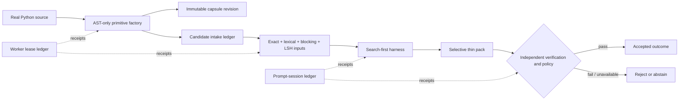

# Business model and product vertical slice

## Decision

Taedri is best treated as a **verified code-capability registry and coding-agent control
plane**, not as another code search box and not as a package registry that assumes one
repository per helper.

The initial product wedge is a private capability registry plus a search-first coding
harness. It indexes an organization's existing code, packages reusable candidates into
small content-addressed capsules, lets an agent retrieve the smallest useful context,
and records whether policy and verification accepted or rejected the attempted reuse.

The core value unit is an **independently accepted, policy-compliant outcome**. A search
hit, generated candidate, model response, retry, failure, or abstention is not a
successful outcome. This keeps the product incentive aligned with the governing rule:
retrieval nominates; evidence, contracts, policy, and verification decide.

The machine-readable commercial hypothesis is
[`architecture/business-model.v1.json`](../../architecture/business-model.v1.json).
Currency prices and ROI claims are intentionally unset until customer discovery, real
provider costs, retention, retrieval lift, and verification economics exist.

## Offer ladder

1. **Local evaluator.** Pre-alpha source for local ingestion, search, capsules, CLI, and
   MCP evaluation. A project license must be selected before describing this as an
   open-source commercial tier.
2. **Team private registry.** Base subscription with private namespaces, access policy,
   candidate review, search, storage, and audit receipts. Capacity meters use deduplicated
   active entities and compressed retained evidence.
3. **Managed verification control plane.** Platform subscription plus disclosed worker,
   verification, and third-party provider usage. Only independently accepted results can
   use the accepted-outcome meter.
4. **Enterprise/self-hosted.** Annual agreement for residency, dedicated deployment,
   SSO/SCIM, private model adapters, policy packs, assurance, and support.
5. **Marketplace, later.** Signed portable releases and policy-scoped reputation could
   support a take rate, but only after supply, demand, licensing, and trust are proven.

## Implemented end-to-end POC



The current real-source run scanned Taedri's own `src/taedri_codegraph` tree without
importing or executing it. It produced 347 function/method candidates, 1,812
syntax-derived `calls_may` edges, one search descriptor and candidate contract per
primitive, 1,388 intake events, two successful worker jobs, a selectively materialized
pack, and one digest-only harness session. That session abstained because no model or
independent verifier was configured; zero candidates were promoted.

This is an important product behavior, not a missing success badge: the system can
retrieve and materialize useful code while still refusing to claim it is approved.

## Primitive factory and population tools

Run the real-source population job:

```bash
PYTHONPATH=src python tools/populate_primitive_candidates.py
python tools/generate_registry_console.py
```

The factory creates, for every discovered Python function or method:

- an original-file blob shared by digest across candidates;
- a small UTF-8 function fragment for cheap selective download;
- a syntax-derived candidate contract with parameters, return annotation, decorators,
  unknown effect/exception states, license evidence, and exact source selection;
- a search descriptor with aliases, tokens, keyphrases, call labels, blocking keys,
  narrow/medium/wide LSH inputs, recommended embedding channels, and a D2 disclosure
  view;
- a candidate graph neighborhood containing evidence-scoped `calls_may` edges;
- an immutable primitive tree, revision, candidate branch, submission, and four intake
  state events.

Embeddings are recorded as `not_attempted`. The adaptive rule is to generate them only
when ambiguity or an evaluation shows marginal retrieval value. This avoids paying to
embed every helper while keeping source, documentation, contract, graph, and other
future embedding channels independently versionable.

The next factory adapters should consume the existing wheel/PyPI and Git acquisition
receipts, followed by SCIP/Tree-sitter/CPG outputs for non-Python languages. They should
emit the same capsule, descriptor, intake, and evidence contracts rather than adding
language-specific columns to the registry core.

## Search and front end

The self-contained [`registry-console.html`](../../apps/explorer/registry-console.html)
is a working frontend POC with candidate text/kind/module filtering, selected primitive
details, kind distributions, worker and prompt-session timelines, the offer ladder,
meters, and commercial validation gates. It embeds only generated POC data and makes no
network requests. Clone the repository and open the file directly in a browser.

GitHub can render these generated static views directly:


Raw search and graph artifacts are in
[`eval/results/primitive-factory-2026-07-16`](../../eval/results/primitive-factory-2026-07-16/):

- `search-index.jsonl` contains exact, lexical, blocking, LSH-input, and deferred
  embedding projection records;
- `candidate-summary.csv` supports spreadsheet inspection and sorting;
- `candidates.jsonl` retains immutable candidate identities and provenance;
- `submissions.jsonl` and `intake-events.jsonl` retain complete intake provenance;
- `primitive-candidates.graphml` contains the complete candidate-to-call-label graph;
- `primitive-candidates.mmd` is a bounded GitHub-friendly graph slice;
- `selected-candidate.tcgpack` is a real thin-download capsule;
- `candidate-manifest.json` reconciles source, counts, workers, intake, session, and pack.
- `worker-receipts.json` and `harness-session.json` expose the operational traces as
  standalone integration fixtures.

## Worker and harness integration

The worker reference contract provides queue-scoped idempotency, priority,
capability-aware exclusive leases, caller-supplied lease nonces, attempt limits,
success/failure/expiry receipts, retries, and dead letters. Production ports can map
these rules onto PostgreSQL, a managed queue, or a Fly process group without changing
job identity.

The prompt-session ledger records start, digest-only request capture, search receipts,
candidate selection, materialization, model attempts, verification, acceptance,
abstention, and closure. Digest-only mode rejects raw prompt/message/source-body fields.
Acceptance is impossible without an earlier model-attempt and verification receipt.

The intended hook sequence for Codex, Claude, an IDE, CI, or another harness is:

1. Hash or securely reference the request and repository snapshot.
2. Call body-free search at D0/D1 and retain the fusion receipt.
3. Select candidates and request contract/graph context at D2/D3.
4. Check license, provenance, policy, and directional compatibility.
5. Materialize only selected capsule roles at D4 or deeper.
6. If code is changed or executed, use an isolated worker and retain its receipt.
7. Accept only after the caller's verifier and policy gate; otherwise reject or abstain.

## Monorepo now, service boundaries later

The monorepo now gives explicit ownership to:

- `packages/primitive-factory` for source-backed candidate generation;
- `packages/primitive-registry` for capsules, revisions, refs, and packs;
- `packages/session-ledger` for privacy-aware harness receipts;
- `services/worker-runtime` for leased asynchronous work;
- `services/indexer`, `services/query-api`, and `services/registry-api` for orchestration,
  serving, and mutations;
- `apps/explorer` for the human console;
- `integrations/agents` and `integrations/mcp` for coding harnesses.

The first hosted form should remain one image with independently scaled `web` and
`indexer/worker` process groups, PostgreSQL for transactional control-plane state, and
S3-compatible storage for immutable payloads. Split an independent service only after a
measured security, scaling, failure-domain, runtime/release, ownership, or residency
gate remains violated after vertical and process-group scaling.

## Explicit remaining gates

- The primitive factory currently packages Python functions and methods, not every Atlas
  entity kind or a polyglot semantic graph.
- Remote PyPI/Git acquisition is separate from this run; the run used checked-out real
  source and content digests.
- Search descriptors exist, but this run did not build ANN vectors or call an embedding
  provider.
- The worker, registry, intake, and session stores are in-memory conformance
  implementations, not transactional production adapters.
- No real LLM, sandbox verifier, tenant authorization, signing service, billing system,
  or Fly deployment was invoked.
- Project and source licensing remain unknown; public promotion is blocked by contract.
- Business pricing, ROI, and marketplace demand remain hypotheses requiring evidence.
