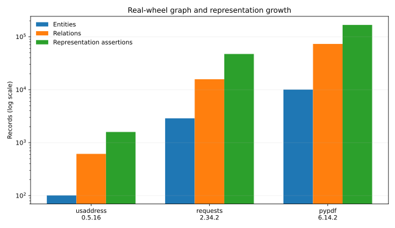
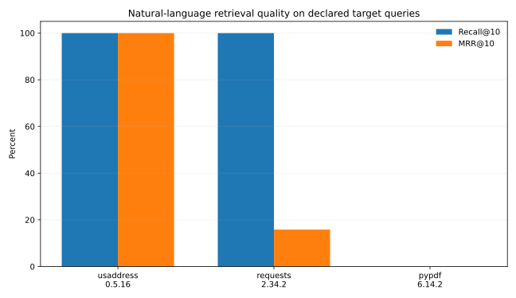
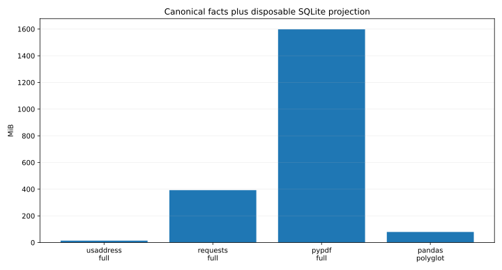

# Hybrid architecture challenge on real packages

**Run date:** 2026-07-15  
**Code status:** pre-alpha POC  
**Result:** logical extensibility passed; current physical storage and semantic retrieval
did not pass a production-readiness bar.

## Executive result

The POC successfully performed non-executing, end-to-end wheel verification, AST
extraction, immutable epoch publication, typed representation storage, provenance search,
hybrid retrieval, and graph export on three real PyPI wheels. It also inventory-published
all 1,411 Python files owned by the installed Pandas 2.2.3 distribution.

The challenge found two hard limits:

1. JSONL facts plus the current SQLite serving projection reached **1,598.1 MiB** for the
   55-file PyPDF wheel. This is a correctness/debug layout, not a production layout.
2. The deterministic lexical-vector hybrid achieved **0/3 Recall@10 on PyPDF**. It tests
   vector plumbing but does not provide semantic understanding. A real code/text embedding
   provider and calibrated fusion are necessary.

These are useful failures. Neither requires changing entity identity or the universal
representation envelope.

## Artifacts

- [Raw package JSON](../../eval/results/hybrid-architecture-2026-07-15/package-results.json)
  and [CSV](../../eval/results/hybrid-architecture-2026-07-15/package-results.csv)
- [Raw per-query/lane JSON](../../eval/results/hybrid-architecture-2026-07-15/query-results.json)
  and [CSV](../../eval/results/hybrid-architecture-2026-07-15/query-results.csv)
- [Graph slices](../../eval/results/hybrid-architecture-2026-07-15/graphs/) as JSON,
  Mermaid, and GraphML
- [Evaluation driver](../../tools/evaluate_hybrid_real_packages.py)







## Inputs and safety profile

| Distribution | Version | Artifact | SHA-256 | Python files |
|---|---:|---|---|---:|
| [usaddress](https://pypi.org/project/usaddress/0.5.16/) | 0.5.16 | wheel | `ce2bd73e…c182a6a` | 1 |
| [Requests](https://pypi.org/project/requests/2.34.2/) | 2.34.2 | wheel | `2a0d60c…7e278e0` | 19 |
| [pypdf](https://pypi.org/project/pypdf/6.14.2/) | 6.14.2 | wheel | `3f07891a…12e946` | 55 |
| [pandas](https://pypi.org/project/pandas/2.2.3/) | 2.2.3 | installed distribution inventory | distribution-owned source bytes | 1,411 |

The three wheels were downloaded as immutable bytes. The evaluator did not import,
install, build, or execute target package code. It rejected unsafe archive paths and
verified `RECORD` hashes/sizes before extraction:

| Wheel | Archive members | `RECORD` entries | Hashes verified | Declared-license assertions |
|---|---:|---:|---:|---:|
| usaddress | 8 | 8 | 7 | 3 |
| Requests | 26 | 26 | 25 | 4 |
| pypdf | 60 | 60 | 59 | 2 |

The un-hashed row in each wheel is its permitted `RECORD` row. License assertion counts
include parallel raw/SPDX/classifier/license-file facts when present; they are not a count
of “licenses,” and no legal conclusion was inferred.

## Graph and storage results

| Package/mode | Files | Entities | Relations | Representation assertions | Analysis | Publish/index | Facts | SQLite index |
|---|---:|---:|---:|---:|---:|---:|---:|---:|
| usaddress full AST/hybrid | 1 | 101 | 614 | 1,593 | 1.4 s | 0.8 s | 6.5 MiB | 7.7 MiB |
| Requests full AST/hybrid | 19 | 2,878 | 15,756 | 47,253 | 39.9 s | 24.7 s | 183.6 MiB | 209.2 MiB |
| pypdf full AST/hybrid | 55 | 10,059 | 73,181 | 167,392 | 174.4 s | 101.4 s | 724.6 MiB | 873.5 MiB |
| pandas inventory only | 1,411 | 1,412 | 1,411 | 16,944 | 6.3 s | 7.5 s | 38.5 MiB | 40.8 MiB |

The Pandas result is intentionally not comparable extraction depth. It demonstrates that
the file/snapshot/representation spine can inventory a large real distribution cheaply,
then accept semantic enrichers later. It does not claim function-, type-, or call-level
coverage for Pandas.

The full-AST results show that file count alone is a poor workload predictor. Entity,
occurrence, evidence, relation, and representation cardinality dominate. The current
index also duplicates some ledger data for convenient debug queries. The production
direction is cold columnar facts plus explicitly promoted serving indexes, described in
the [architecture decision](../architecture/UNIVERSAL_REPRESENTATION_ARCHITECTURE.md).

## Retrieval method

The query set is declared in the evaluation driver. A hit requires an **exact qualified
name** match in the first ten results; descendants such as `usaddress.parse.address_string`
do not count as `usaddress.parse`.

The full hybrid combines:

- exact IDs/names;
- FTS5 over names, docstrings, synopsis, and registered lexical representations;
- identifier blocking keys;
- a deterministic signed lexical hash vector;
- weighted reciprocal-rank fusion and a small structural-kind prior.

Each query was also run with lexical-only, blocking-only, and vector-only profiles. This
is nine queries—enough to find architectural failures, not enough for a general quality
claim.

## Retrieval results

| Package | Queries | Recall@10 | MRR@10 | Top-1 | Median hybrid latency | P95 latency |
|---|---:|---:|---:|---:|---:|---:|
| usaddress | 3 | 100% | 1.000 | 100% | 1.7 ms | 1.7 ms |
| Requests | 3 | 100% | 0.158 | 0% | 29.9 ms | 35.2 ms |
| pypdf | 3 | 0% | 0.000 | 0% | 46.3 ms | 48.4 ms |

### Exact target outcomes

| Package | Intent | Target | Hybrid rank | Top result |
|---|---|---|---:|---|
| usaddress | Parse address components | `usaddress.parse` | 1 | target |
| usaddress | Tag components/type | `usaddress.tag` | 1 | target |
| usaddress | Tokenize an address | `usaddress.tokenize` | 1 | target |
| Requests | Send HTTP GET | `requests.api.get` | 10 | `requests.models.Request` |
| Requests | Persistent session request | `requests.sessions.Session.request` | 8 | `requests.sessions.Session.send` |
| Requests | Decode response JSON | `requests.models.Response.json` | 4 | `requests.utils.stream_decode_response_unicode` |
| pypdf | Read PDF document | `pypdf._reader.PdfReader` | miss | `pypdf._writer.PdfWriter.clone_document_from_reader` |
| pypdf | Extract page text | `pypdf._page.PageObject.extract_text` | miss | `pypdf._text_extraction._text_extractor.TextExtraction` |
| pypdf | Write PDF to stream | `pypdf._writer.PdfWriter.write` | miss | `pypdf._writer.PdfWriter.clone_document_from_reader` |

### What the lane ablation exposed

- On usaddress, lexical names/docstrings were already sufficient. The extra lanes did not
  manufacture the success.
- Requests had full recall but poor ordering. `Response.json` ranked first in lexical-only
  search but fourth after fusion; fusion is not monotonically beneficial.
- `PageObject.extract_text` ranked first in PyPDF's blocking-only lane but missed the fused
  top ten. This is a concrete fusion-calibration failure, visible because receipts retain
  lane ranks.
- The deterministic vector missed every Requests and PyPDF target in its top ten. It is a
  lexical feature hash, not a semantic embedding.

The correct next experiment is a pinned semantic text/code embedding and a frozen query
set, followed by calibrated or learned fusion. It would be misleading to rename or tune
the current deterministic vector until it appears semantic.

## Architecture findings

### Passed

1. New license, label, metric, blocking, vector, and router fields require descriptors and
   assertions, not entity schema changes.
2. Content deduplication does not erase attempt/model/evidence provenance.
3. Wheel distribution identity and import namespace are separate; the same adapter handles
   names such as `python-pptx`/`pptx`.
4. Exact, lexical, facet, scalar, blocking, LSH, vector, graph, and metadata paths coexist
   behind replaceable projections.
5. CLI, MCP, Codex skill, Claude skill, `AGENTS.md`, and `CLAUDE.md` share one progressive
   disclosure contract.
6. A 1,411-file real distribution can be published at inventory depth without pretending
   semantic coverage.

### Failed or incomplete

1. Current JSONL/SQLite storage amplification is unacceptable at PyPDF scale.
2. No real semantic embedding or LLM classifier was invoked; only provider contracts are
   implemented.
3. Hybrid fusion is not calibrated and can suppress a lane's strongest result.
4. Python analysis is syntax-only and overproduces lower-level variables/parameters for
   API-oriented search.
5. Source literals, runtime objects, inferred types, effects, compatibility proofs, and
   hierarchy closure are not implemented.
6. Remote PyPI/GitHub acquisition, sdist policy, SCIP/Tree-sitter/CPG import, SBOMs,
   license detection/compatibility, ACLs, and bitemporal serving remain future work.

## Reproduce

```bash
python -m unittest discover -s tests -v

python tools/evaluate_hybrid_real_packages.py \
  /path/to/usaddress-0.5.16-py3-none-any.whl \
  /path/to/requests-2.34.2-py3-none-any.whl \
  /path/to/pypdf-6.14.2-py3-none-any.whl \
  --inventory pandas
```

Environment for this run: Linux 6.12 x86-64, CPython 3.12.13, SQLite 3.50.4,
9 visible CPUs. Timings are single observations in a shared development container and are
not capacity-planning measurements.

## Decision

Continue with the universal representation model and provider boundary. Before expanding
full-AST coverage to larger corpora, replace the physical fact/index layout and establish
a frozen relevance benchmark with a real embedding provider. The next storage prototype
should compare compressed Parquet facts plus DuckDB/PostgreSQL/pgvector projections against
this preserved baseline.
