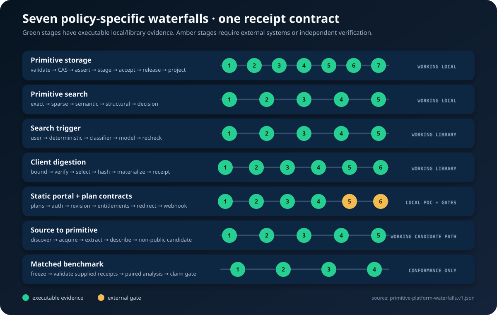

# Primitive-platform waterfall acceptance

Date: 2026-07-16
Branch: `agent/initial-vertical-slice`
Base commit before the local implementation: `7877994`
Claim class: verified local/transitional system; hosted production and real-model
efficacy remain external gates

## Result

The seven requested platform mechanisms now have executable boundaries, shared policy
semantics, machine-readable contracts, and acceptance evidence. The implementation is a
modular monolith with independently containerizable web, worker, explorer, and portal
processes; it does not pretend that every folder is already an independently operated
microservice.

| Waterfall | Implemented scope | Deliberately open gate |
|---|---|---|
| Primitive storage | Typed long-table facts, content-addressed values, immutable runs/assertions, lineage DAGs, preferred views, and rebuildable exact/lexical/scalar/blocking/vector/graph projections | Live PostgreSQL repository and S3-compatible adapter |
| Primitive search | Adaptive exact → sparse → semantic → structural retrieval with fast/balanced/deep/auto policy and stage receipts | Live embeddings/ANN relevance and load gates |
| Search triggering | User, deterministic, classifier, and model tiers with fixed precedence, privacy guards, cooldowns, and intent revalidation | Hosted hook/plugin session study |
| Client digestion | Bounded selective/thin packs, digest and path verification, role allowlists, atomic writes, and receipts | Signed-pack trust policy and cross-language clients |
| Static portal and plan contracts | Static portal POC, plan catalog, append-only subscriptions, replay-safe billing-event contracts, entitlements, scoped APIs, and generated OpenAPI | OIDC+PKCE and a real billing test adapter |
| Source to primitive | Replay-safe PyPI/GitHub discovery contracts, bounded acquisition, non-executing extraction, candidate generation, and shared API/worker operation catalog | Hostile-code isolated verifier, additional language runtimes, and signed release evidence |
| Matched benchmark | Frozen experiment identities, matched-lane contracts, failure-inclusive reporting, and claim gate | Real model, sealed tasks, and an isolated verifier |

The central storage regression caught during this work was real: a custom descriptor
registry was accepted by the immutable ledger but silently replaced by the built-in
registry during projection. That would have retained new license, scalar, character, or
vector facts while making them unexpectedly unsearchable. The storage path now passes
the exact validated registry through index construction, and the regression test proves
all four families plus multi-parent lineage project without a schema migration.

## Executed acceptance

| Check | Exact result |
|---|---|
| Complete Python suite | 233 tests passed in 34.023 seconds; one optional MCP test skipped in the core-only environment and passed separately with the agent extra installed |
| API inventory | 41 operations across 37 paths; OpenAPI generated from the same catalog |
| PostgreSQL contract | Migrations `001` and `002` applied twice under PGlite; current contract has 44 `taedri` tables |
| Flexible descriptor regression | SPDX keyword, integer scalar, one-character keyword, dense vector, and multiple lineage assertions indexed without ledger migration |
| Complete primitive release | One 12-role/13-payload reference primitive executed six cases and passed all 12 acceptance proofs and 14 release proofs |
| Deterministic reuse | Two active releases, 12 evidence-bound edges, four typed ports, one exact wire, two verified packs, and `"  Straße  " → "strasse"` with zero model calls or rewritten code |
| Evidence reproducibility | Repeated reference-release and deterministic-route generation produced byte-identical reports, receipts, CSV, and pack files |
| Gunicorn process-manager loopback smoke | A local Gunicorn socket returned `health=ok` and `ready=ready`; this proves process/socket behavior only, not production readiness |
| MCP protocol | Real stdio initialize, tools/list, and adaptive primitive-search round trip passed |
| Installable package | Wheel built, installed into a clean virtual environment, imported; current catalog exposes 41 operations across 37 paths |
| Wheel digest | `sha256:7910589a6d6012391c6346c86ac1a219832728211be329f8adecdc21d4d7dd31` (239,973 bytes) |
| Static validation | Python compilation, seven inline frontend scripts, 79 JSON files, 19 SVG files, and four YAML files passed syntax checks |
| Patch hygiene | `git diff --check` passed |
| Local container build | Not executed: a Docker executable is unavailable in this workspace |
| Hosted Actions | Not executed: the new local branch state is not published |

The complete test command was:

```bash
PYTHONPATH=src python -m unittest discover -s tests -v
PYTHONPATH=src /tmp/taedri-mcp-venv/bin/python -m unittest \
  tests.integration.test_mcp_protocol -v
```

The installability check built `taedri_codegraph-0.1.0a0-py3-none-any.whl`, installed it
without dependencies into a clean virtual environment, imported the package, and built
OpenAPI from the installed wheel.

## Evidence and visuals

- `architecture/primitive-platform-waterfalls.v1.json` is the authoritative seven-row
  waterfall inventory.
- `eval/results/primitive-platform-waterfalls-2026-07-16/acceptance.json` contains the
  machine-readable acceptance result.
- `eval/results/reference-primitive-acceptance-2026-07-16` contains the complete
  single-primitive release, search, download, and acceptance receipt.
- `eval/results/deterministic-primitive-pipeline-2026-07-16` contains both complete
  packs, exact wire assessment, content-addressed plan/receipt, and no-model output.
- `eval/results/primitive-platform-waterfalls-2026-07-16/waterfalls.csv` is a compact
  analysis table.
- `eval/results/primitive-platform-waterfalls-2026-07-16/component-readiness.csv`
  contains all 32 component statuses.
- `eval/results/primitive-platform-waterfalls-2026-07-16/waterfall-readiness.svg`
  visualizes the implemented and gated stages.
- `docs/visuals/architecture-explorer.html` remains the interactive component explorer,
  and `docs/visuals/assets/monorepo-component-topology.svg` shows all 32 boundaries.

The prior non-synthetic `usaddress==0.5.16` PyPI wheel and immutable GitHub commit runs
remain valid input evidence: the acquired target was not installed, imported, built, or
executed; extraction produced searchable entity, relationship, representation, query,
GraphML, Mermaid, CSV, JSON, and backup artifacts.

## Readiness snapshot

The validated architecture manifest declares 32 components: 22 working in their named
local/transitional scope, eight partial, one conformance-only, and one deployment POC.
“Working” is scope-qualified by `architecture/component-readiness.v1.json`; it is not a
claim of hosted durability, security, or SLOs.



## Remaining evidence gates

1. Publish the branch and run GitHub-hosted tests, PostgreSQL 17 migrations, and all
   container builds.
2. Add live PostgreSQL and S3-compatible repository adapters, then exercise backup,
   restore, projection rebuild, and concurrent compare-and-swap behavior.
3. Configure OIDC authorization code with PKCE and a billing-provider test environment;
   verify signed, replay-safe webhooks and entitlement reconciliation.
4. Run matched bare-model and primitive-assisted lanes against sealed non-synthetic tasks
   in a resource-isolated verifier. Until then, token, speed, quality, and ROI claims are
   intentionally blocked.
5. Deploy staging, establish telemetry and tenant-isolation tests, and complete recovery
   drills before describing the system as production SaaS.

No API key should be pasted into chat or committed. GitHub, model, billing, database,
object-store, and Fly.io credentials should be scoped to staging and injected through a
secret manager or the execution environment.
