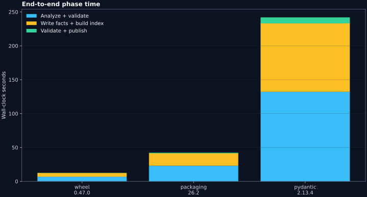
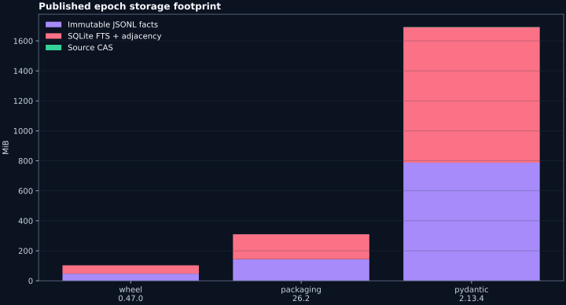
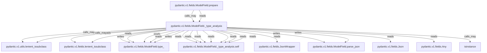

# Taedri CodeGraph real-PyPI benchmark

- **Run date:** 2026-07-15
- **Taedri version:** 0.1.0a0
- **Python:** 3.12.13
- **Profile:** non-executing CPython AST syntax analysis, immutable JSONL facts, SQLite FTS5 + adjacency, atomic publication

## Outcome

Taedri completed end-to-end publication for 3 real installed PyPI distributions. Package code was never imported or executed. Distribution-owned `.py` bytes were selected through installed Core Metadata, copied into a temporary immutable input tree, hashed, parsed, validated, indexed, queried, and published.

| Distribution | Version | `.py` files | Source MiB | Entities | Occurrences | Relations | Total sec | Peak RSS MiB | Store MiB | Coverage |
|---|---:|---:|---:|---:|---:|---:|---:|---:|---:|---|
| wheel | 0.47.0 | 15 | 0.08 | 1,368 | 3,691 | 7,625 | 12.6 | 122.4 | 103.3 | complete_for_declared_syntax |
| packaging | 26.2 | 20 | 0.35 | 3,363 | 11,213 | 22,942 | 42.3 | 320.0 | 310.5 | complete_for_declared_syntax |
| pydantic | 2.13.4 | 105 | 1.69 | 20,616 | 59,423 | 123,342 | 242.0 | 1614.9 | 1693.2 | complete_for_declared_syntax |






## What the first real run proves

- The truth/search boundary works on non-synthetic packages: facts are validated before the disposable FTS/adjacency projection is published.
- Every published relation has exact participants, modality, quantifier, producer, analysis scope, and source-range evidence.
- Parse coverage is explicit; an unresolved file would yield `attempted_partial` instead of a false claim that no entities or callers exist.
- Exact package, analysis, and epoch identities make the result replayable and allow prior epochs to remain addressable.
- Search and neighbor operations run against the published epoch without importing the analyzed distribution.

## Real-data defect found and fixed

The first Pydantic run reported 105 distribution-owned Python paths but only 104 analyzed files. Two paths had identical bytes, and the prototype had incorrectly used `FileContentID` as the path-occurrence key. Real package data caught the identity-lattice error immediately.

The final implementation now keeps:

- `SourceFileID = hash(relative path + FileContentID)` for each file occurrence;
- `FileContentID = hash(exact bytes + size)` for byte-level deduplication;
- occurrences and evidence linked to both identities.

A regression fixture proves that two paths with the same bytes remain two source files while sharing one content object. The final Pydantic run accounts for all **105/105** Python files.

## Scale finding and immediate engineering consequence

The largest run, **pydantic 2.13.4**, expanded 1.69 MiB of Python source into 20,616 entities, 59,423 occurrences, and 123,342 relation assertions. Its current prototype store is 1693.2 MiB; the SQLite projection accounts for 53.4%.

That is useful bad news: correctness held, but repeating canonical keys and full relation JSON inside both JSONL and SQLite is too expensive. The next storage milestone should introduce stable per-shard ordinals, dictionary encoding, compressed Arrow/Parquet fact shards, compact participant tables, and cards rather than full records in FTS rows. Canonical identities and evidence stay unchanged; only the disposable physical projection changes.

## Selected evidence graph

The graph below is a bounded, deterministic slice around the highest-degree non-file/non-module entity in the largest run. Approximate compatibility edges are not mixed into it.



Machine-readable copies: [JSON](../../eval/results/real-pypi-2026-07-15/graphs/pydantic-2.13.4-slice.json), [GraphML](../../eval/results/real-pypi-2026-07-15/graphs/pydantic-2.13.4-slice.graphml), and [Mermaid](../../eval/results/real-pypi-2026-07-15/graphs/pydantic-2.13.4-slice.mmd).

## Raw data

- [Aggregate JSON](../../eval/results/real-pypi-2026-07-15/summary.json)
- [Package metrics CSV](../../eval/results/real-pypi-2026-07-15/package_metrics.csv)
- [Predicate counts CSV](../../eval/results/real-pypi-2026-07-15/predicate_counts.csv)
- Per-package manifests and graph slices are under [`packages/`](../../eval/results/real-pypi-2026-07-15/packages/) and [`graphs/`](../../eval/results/real-pypi-2026-07-15/graphs/).

## Reproduce

```bash
python tools/benchmark_real_packages.py wheel packaging pydantic
```

The large local epoch stores are intentionally excluded from Git. They are rebuildable from the recorded exact package versions and the benchmark tool; committing multi-gigabyte disposable indexes would contradict the architecture.

## Limits of this result

- Inputs are installed wheel contents, not yet independently downloaded wheel + sdist pairs with PyPI hash receipts.
- This is syntax-only evidence. Type assignability, SCIP reconciliation, runtime behavior, effects, and compatibility remain `unknown` unless separately analyzed.
- Timings and peak RSS describe this machine and are not cross-machine performance claims.
- The finite golden and poison corpora prove tested behavior, not a production error bound.
