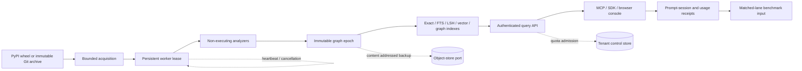
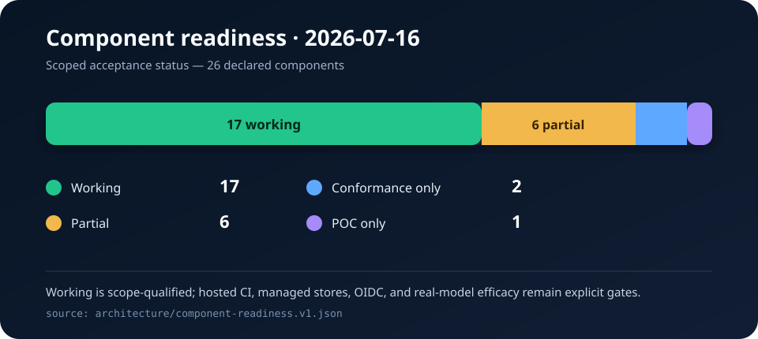

# Working-system checkpoint

Date: 2026-07-16
Branch: `agent/initial-vertical-slice`
Base commit before this checkpoint: `7877994`
Claim class: verified local and transitional implementation; not hosted-production or
real-model efficacy evidence

## Result

Taedri CodeGraph has moved beyond a documentation scaffold into an executable local
SaaS vertical slice. Seventeen of the 26 declared components now have machine-tested
working scope, six are partial, two have protocol/conformance evidence only, and one
is a deployment proof of concept.

The working path now includes real PyPI and immutable GitHub acquisition, safe static
analysis, immutable graph publication, hybrid retrieval, tenant authentication,
quotas and usage receipts, durable jobs with heartbeats and cancellation, primitive
revision/fork storage, prompt-session receipts, an authenticated SDK and MCP server,
a browser operations console, a multi-worker production HTTP boundary, and portable
backup/restore.

“Working” is always qualified by the scope in
`architecture/component-readiness.v1.json`. It does not imply that SQLite is a
multi-node production database, that the Fly manifests have been deployed, or that a
real model has demonstrated efficacy.

## Acceptance evidence

| Check | Exact result |
|---|---|
| Complete suite with server and agent dependencies | 175 tests passed in 30.575 seconds |
| MCP protocol | Real stdio initialize, list-tools, and remote search-tool round trip passed |
| Production HTTP boundary | Gunicorn socket returned healthy and ready responses |
| PostgreSQL contract | DDL applied twice; 21 tables present in schema `taedri` under PGlite |
| Python compilation | `src`, `tests`, and `tools` passed `compileall` |
| Frontend parser | Embedded explorer JavaScript parsed successfully in Node |
| Artifact syntax | 19 schema/architecture/deployment JSON files and the GitHub Actions YAML parsed successfully; this checkpoint JSON also parses |
| Patch hygiene | `git diff --check` passed |
| Hosted CI and container builds | Defined, but not yet executed because this branch is not published |

The complete test command was:

```bash
/tmp/taedri-mcp-venv/bin/python -m unittest discover -s tests -t .
```

The production server smoke returned:

```json
{
  "format_version": "1.0.0",
  "health": {"service": "taedri-codegraph", "status": "ok"},
  "ready": {"control_store": "ok", "status": "ready", "tenant_count": 0},
  "server": "gunicorn",
  "socket_round_trip": true
}
```

## Non-synthetic data retained

The existing real-acquisition run remains the source-data acceptance fixture:

| Source | Files | Entities | Relations | Representation assertions | Expected retrieval |
|---|---:|---:|---:|---:|---|
| `usaddress==0.5.16` wheel | 1 | 101 | 614 | 1,886 | `parse`, `tag`, and `tokenize` each ranked first |
| `datamade/usaddress@aa7699b…` | 10 | 417 | 2,282 | 8,075 | all three expected functions found in the top 10 |

The run imported, installed, built, and executed none of the acquired target code.
Exact source digests, job events, query receipts, graph neighborhoods, GraphML,
Mermaid, CSV, JSONL, PNG/SVG charts, and restorable epoch backups are retained under
`eval/results/saas-real-acquisition-2026-07-16`.

## Executable flow



## Readiness snapshot



The authoritative row-level data is available in
`architecture/component-readiness.v1.json` and the checkpoint CSV/JSON artifacts.

## Remaining gates, in order

1. Publish the tested branch and run GitHub-hosted Python, PostgreSQL 17, and container
   build jobs.
2. Implement and conformance-test PostgreSQL and live S3-compatible adapters behind
   the existing repository ports.
3. Run one fixed real model through sealed, non-synthetic matched benchmark lanes in
   a resource-isolated verifier.
4. Add OIDC organization/user roles and replace browser token entry with sign-in.
5. Deploy staging, add telemetry and recovery drills, then measure multi-tenant SLOs.
6. Add billing-sandbox reconciliation only after usage semantics and retention policy
   are frozen.

## Publication blocker

The local GitHub CLI currently has no authenticated host. The implementation and
evidence are therefore intentionally uncommitted and have not changed draft pull
request #1. Publication requires a repository-scoped GitHub session; no token should
be pasted into chat or committed to the repository.
