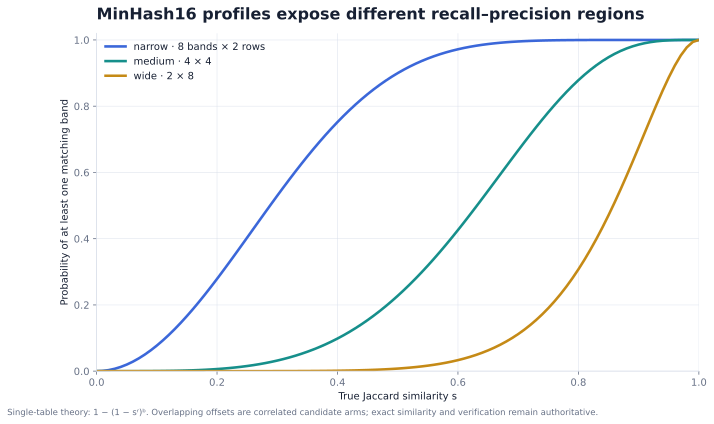
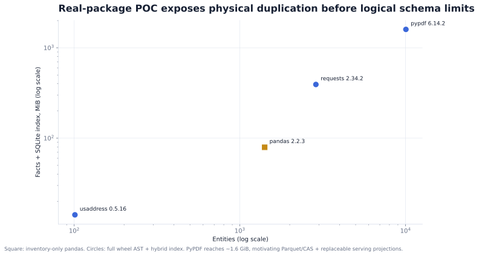
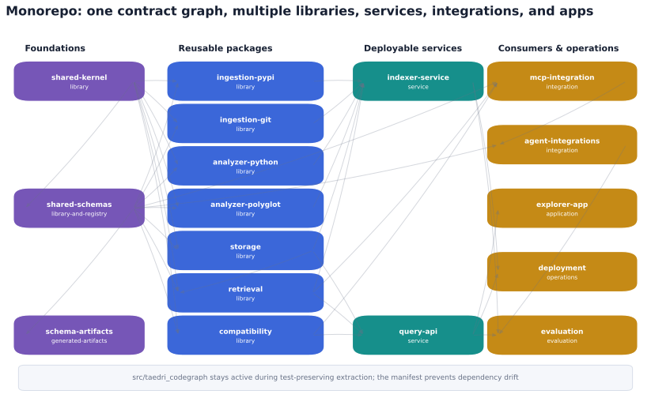

# Architecture visuals

Open the [interactive architecture explorer](architecture-explorer.html) to vary
subject-local enrichment signals, inspect the multi-resolution LSH operating regions,
drill into real-package measurements, and explore the monorepo dependency map.

GitHub does not execute committed HTML in its file viewer. Use the
[interactive branch preview](https://htmlpreview.github.io/?https://github.com/Amarel-Taylor-Scott/TaedriCodeGraph/blob/agent/initial-vertical-slice/docs/visuals/architecture-explorer.html)
or open the self-contained file locally. The SVG previews below render directly on
GitHub without scripts.

GitHub renders the static SVG previews directly:

## Matched benchmark worker and evidence boundary

The [benchmark evidence console](../../apps/explorer/benchmark-console.html) explores
lane rights, frozen inputs, claim gates, campaign tracks, and unit economics. Use the
[interactive branch preview](https://htmlpreview.github.io/?https://github.com/Amarel-Taylor-Scott/TaedriCodeGraph/blob/agent/initial-vertical-slice/apps/explorer/benchmark-console.html)
or open it locally. The checked-in data is a conformance fixture, not model efficacy.


## Real-source primitive factory and product model

The [registry console](../../apps/explorer/registry-console.html) filters the generated
candidate corpus and explores worker, harness, and commercial records. Use the
[interactive branch preview](https://htmlpreview.github.io/?https://github.com/Amarel-Taylor-Scott/TaedriCodeGraph/blob/agent/initial-vertical-slice/apps/explorer/registry-console.html)
or open it locally.


## Typed long-table model


## Adaptive enrichment depth


## Multi-resolution LSH collision regions



## Real-package storage scale



## Monorepo component topology



Source data is available under [`data/`](data/). Regenerate the SVG and PNG assets
with:

```bash
python -m pip install -e '.[research]'
python tools/generate_architecture_visuals.py
```

The LSH chart is theoretical single-table collision probability. The package-scale
chart uses measured data from the real-package POC. Neither is a production capacity
claim.
